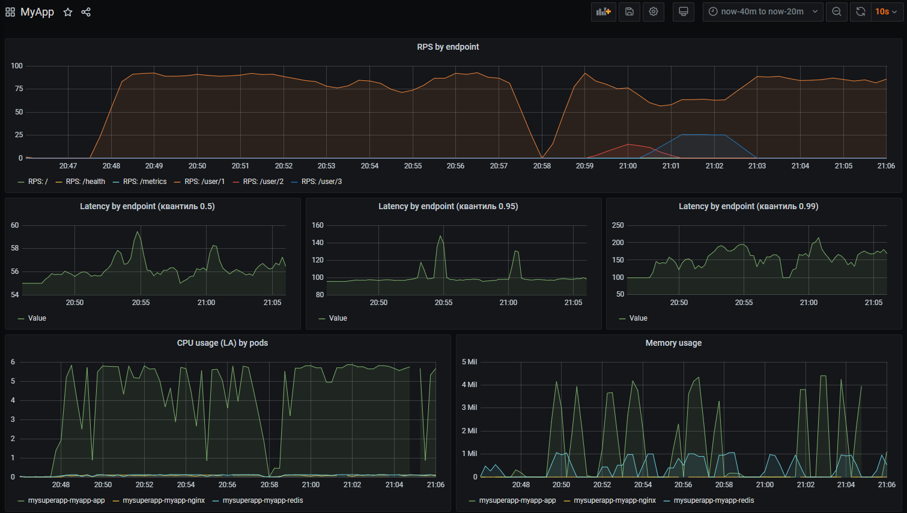
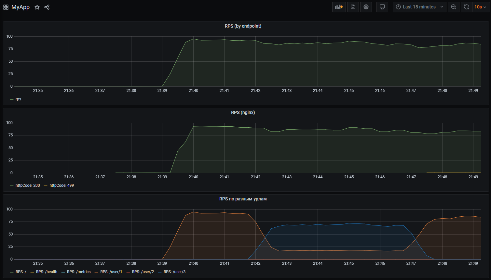
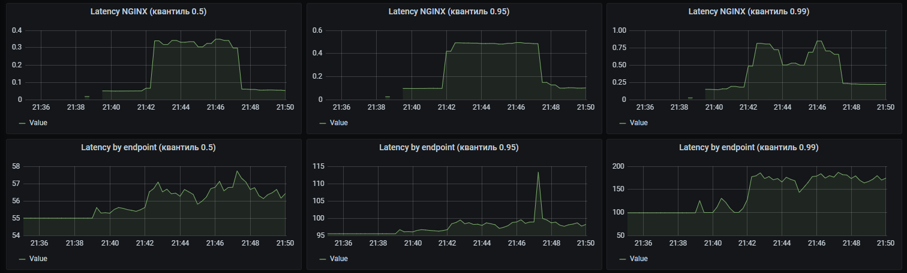
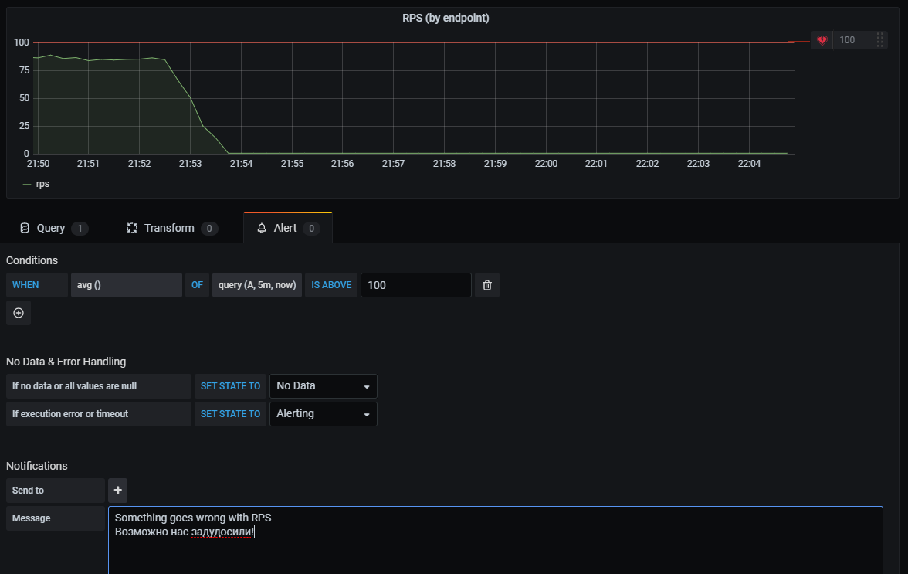
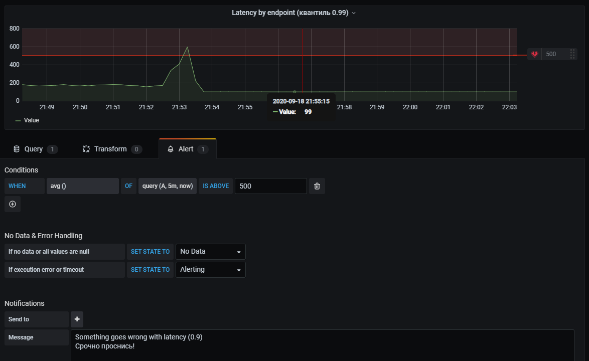
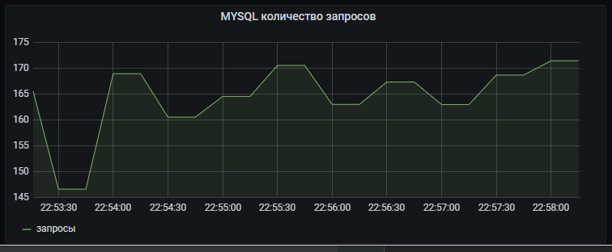

# Установка и инициализация

Если неймспейса myapp нет, создать его:

```
kubectl create namespace myapp
```

Установить приложение из helm:

```
helm install mysuperapp ./helm -n myapp
```

Если неймспейса monitoring нет, создать его:
```
kubectl create namespace monitoring
```

Установить prometheus и grafana:
```
helm install prom stable/prometheus-operator -f prometheus/prometheus.yaml -n monitoring --atomic
```

Запустить prometheus:
```
kubectl port-forward service/prom-prometheus-operator-prometheus 9090  -n monitoring
```

Теперь prometheus доступен тут: [http://localhost:9090/](http://localhost:9090/)

Запустить grafana:
```
kubectl port-forward service/prom-grafana 9000:80 -n monitoring
```

Теперь grafana доступна тут: [http://localhost:9000/](http://localhost:9000/)

логин: admin

пароль: prom-operator

# Результаты

Чтобы поддать нагрузки, выполните

```
kubectl apply -f benchmark/job/run-benchmark.yaml
```
файл  `benchmark/job/run-benchmark.yaml` содержит параметры и урл, по которому будет подана нагрузка.

Внутри там запускается докер с apache benchmark (исходники тут: [benchmark/docker](benchmark/docker)) и долбит наш сервис.

## Дашборд в Графане, c метриками полученными от сервиса

Графики:

(тут же до кучи нагрузка на cpu и потребляемая подами память в разрезе nginx/php/redis)

## Дашборд в Графане, c метриками взятыми с nginx-ingress-controller

Поднимаем nginx-ingress:
```
helm install nginx stable/nginx-ingress -f nginx-ingress/nginx-ingress.yaml
```
Графики RPS и в сравнении для nginx и заинструментированного сервиса:


Графики Latency в сравнении для nginx и заинструментированного сервиса:


## Алертинг на Error Rate и Latency.




 
##  json дашборда

json дашборда графаны можно найти в файле [grafana-dashboard/dashboard.json](grafana-dashboard/dashboard.json)

## Инструментировать базу данных с помощью экспортера для prometheus для этой БД

Опытным путем установлено что рутовый пароль в сервисмонитор mysql не пробрасывается,
поэтому пришлось сделать его пустым

В итоге можем получить например RPS для mysql:

 