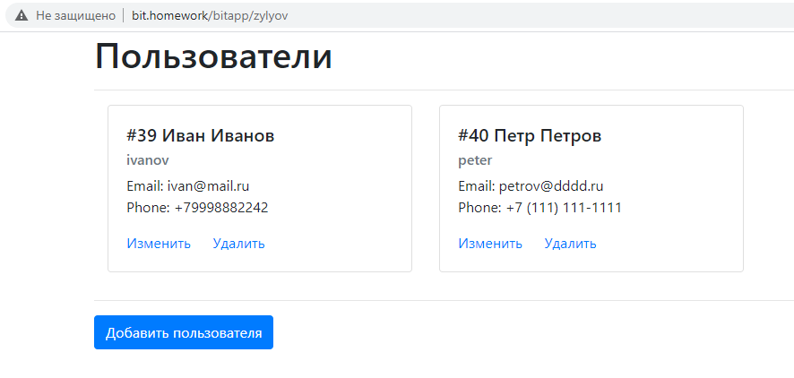
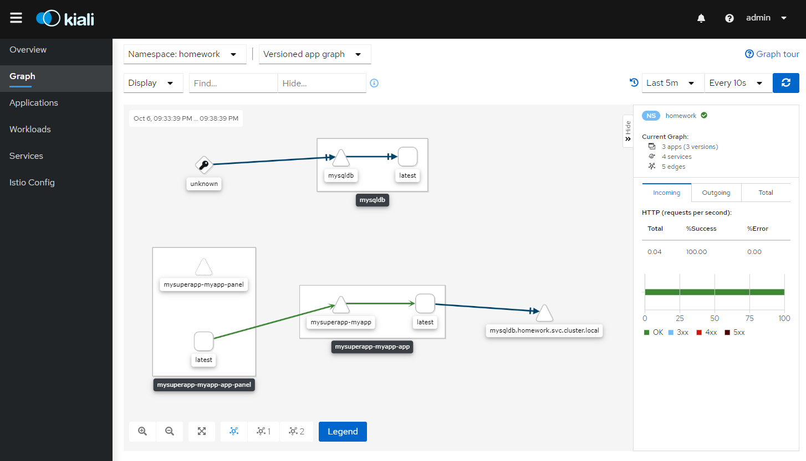

# Service mesh на примере Istio

> обошелся без vagrant 

Если неймспейса homework нет, создать его:

```
kubectl create namespace homework
```

Активируем Istio для неймспейса:
```
kubectl label namespace homework istio-injection=enabled
``` 

Запустим Istio
> манифест от афтара вебинара у меня работать не хотел категорически, даже с его же демо примером,
> поэтому я запускал так:
```
 istioctl install --set profile=demo
```

Запустим наше приложение из helm:
```
helm install mysuperapp ./helm -n homework
```

После установки приложение станет доступно по адресу http://bit.homework/bitapp/zylyov

Чтобы показать взаимодействие цепочки сервисов в Kiali, был написан отдельный сервис
 (исходники тут [docker/user_panel_service](docker/user_panel_service)) 
который представляет собой веб морду для написанного на предыдущих этапах рест апи:

 


Запустим Kiali: 
```
kubectl port-forward service/kiali 8080:20001 -n istio-system
```
Открываем http://localhost:8080/ и вводим логин-пароль admin/admin и видим карту сервисов:



На карте `mysuperapp-myapp-panel` это сервис, интерфейс которого видит пользователь
 и который обращается к `mysuperapp-myapp` (рестапи сервис), 
 который в свою очередь взаимодействует с сервисом базы данных `mysqldb.homework.svc.cluster.local`
 
  