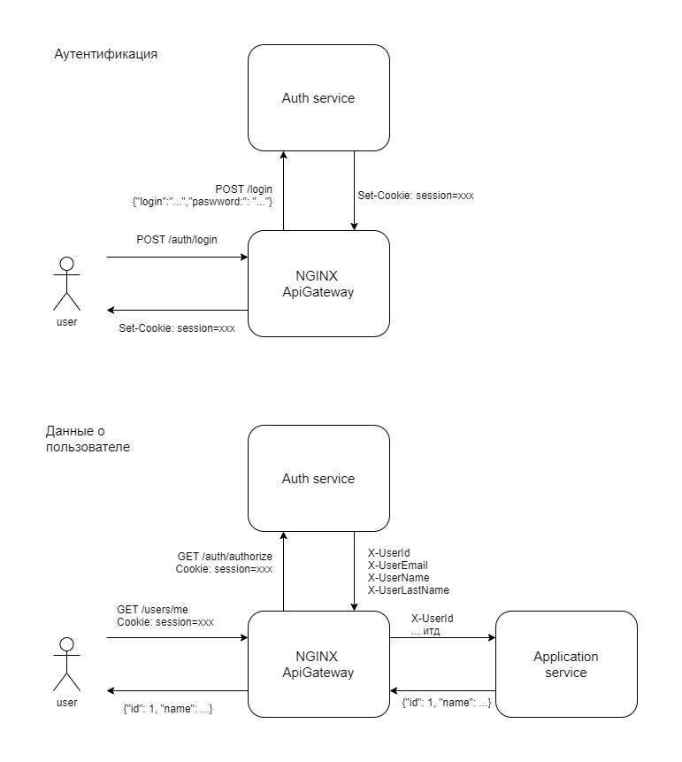
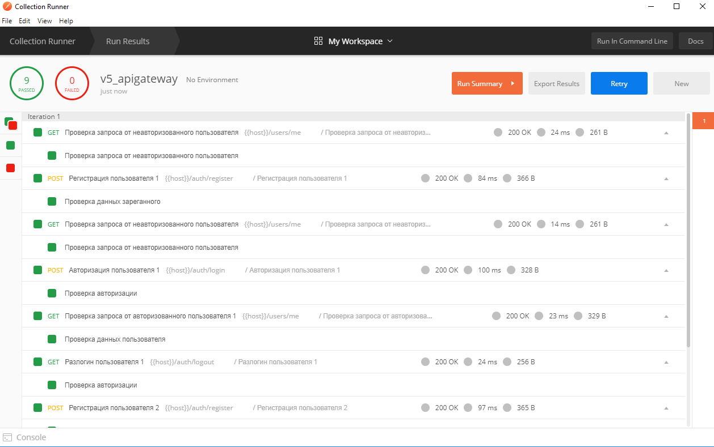

# Описание и схема взаимодействия сервисов

Для хранения авторизации используется сессионная кука. 

Схема взаимодействия сервисов при аутентификации и запросе данных из приложения:

 

# Установка и запуск приложения

Если неймспейса myapp нет, создать его:

```
kubectl create namespace myapp
```

Если встроенный ingress не активирован, надо активировать его:

```
minikube addons enable ingress
```

Установить приложение из helm:

```
helm install mysuperapp ./helm -n myapp
```

Теперь приложение доступно тут: http://bit.homework/users/me

Регистрация тут: http://bit.homework/auth/register

Авторизация тут: http://bit.homework/auth/login
 

# Тесты в постмане

Написаны и работают. Иcходники [тут](postman/collection.json).
Картинка для тех кто не будет их запускать сам:



 
