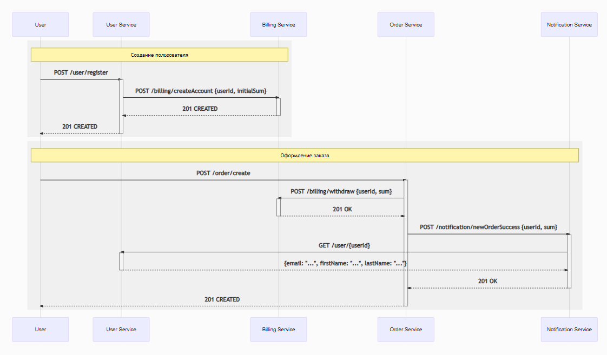
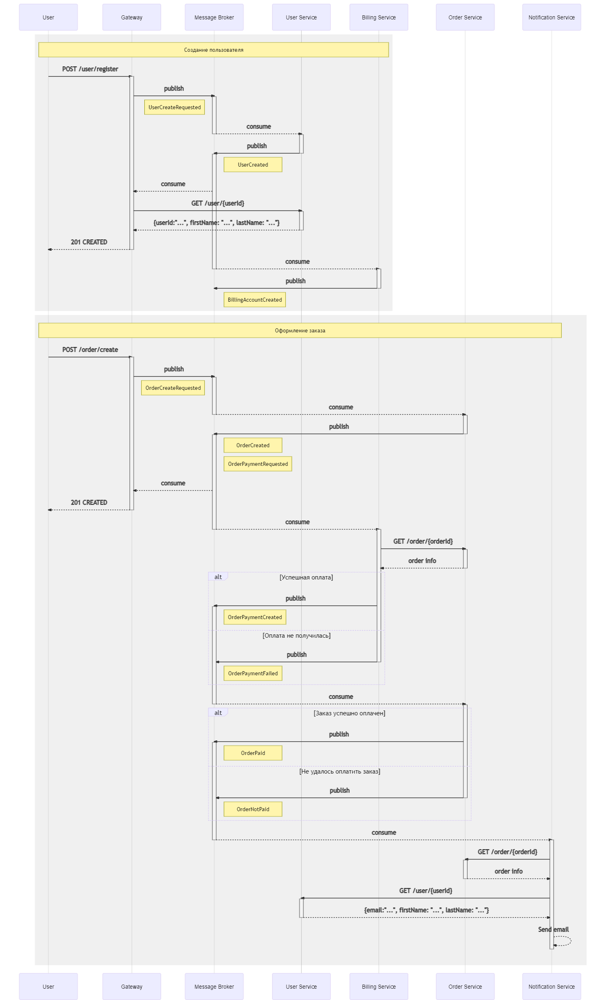
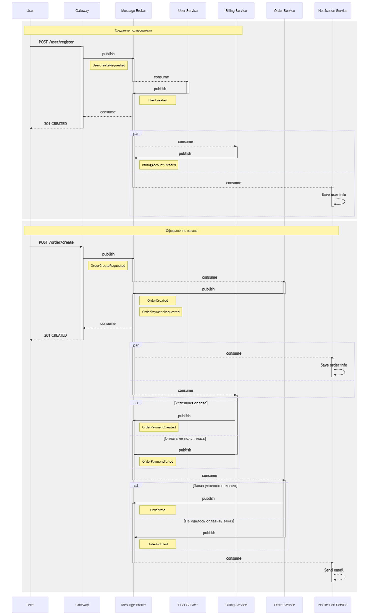
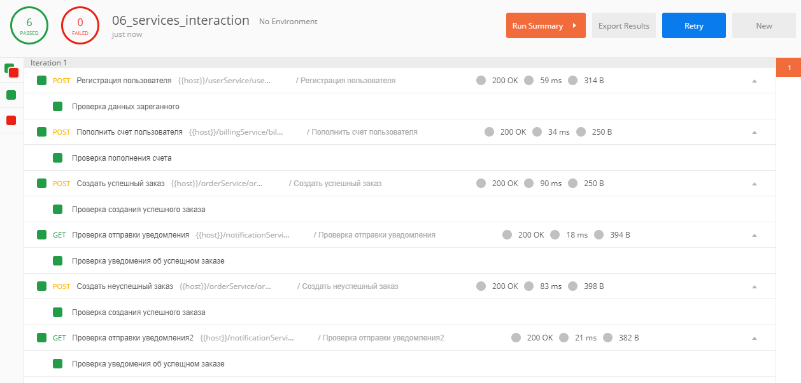

# Выбор способа взаимодействия сервисов

## Синхронное http взаимодействие через rest



[Исходники диаграммы](https://mermaid-js.github.io/mermaid-live-editor/#/edit/eyJjb2RlIjoic2VxdWVuY2VEaWFncmFtXG5cbnBhcnRpY2lwYW50IFVzZXJcbnBhcnRpY2lwYW50IFVzZXIgU2VydmljZVxucGFydGljaXBhbnQgQmlsbGluZyBTZXJ2aWNlXG5wYXJ0aWNpcGFudCBPcmRlciBTZXJ2aWNlXG5wYXJ0aWNpcGFudCBOb3RpZmljYXRpb24gU2VydmljZVxuXG5yZWN0IHJnYigyNDAsIDI0MCwgMjQwKVx0XG5Ob3RlIG92ZXIgVXNlciwgQmlsbGluZyBTZXJ2aWNlOiDQodC-0LfQtNCw0L3QuNC1INC_0L7Qu9GM0LfQvtCy0LDRgtC10LvRj1xuVXNlci0-PlVzZXIgU2VydmljZTogUE9TVCAvdXNlci9yZWdpc3RlclxuYWN0aXZhdGUgVXNlciBTZXJ2aWNlXG5Vc2VyIFNlcnZpY2UtPj5CaWxsaW5nIFNlcnZpY2U6IFBPU1QgL2JpbGxpbmcvY3JlYXRlQWNjb3VudCB7dXNlcklkLCBpbml0aWFsU3VtfVxuYWN0aXZhdGUgQmlsbGluZyBTZXJ2aWNlXG5CaWxsaW5nIFNlcnZpY2UtLT4-VXNlciBTZXJ2aWNlOiAyMDEgQ1JFQVRFRFxuZGVhY3RpdmF0ZSBCaWxsaW5nIFNlcnZpY2VcblVzZXIgU2VydmljZS0tPj5Vc2VyOiAyMDEgQ1JFQVRFRFxuZGVhY3RpdmF0ZSBVc2VyIFNlcnZpY2VcbmVuZFxuXG5yZWN0IHJnYigyNDAsIDI0MCwgMjQwKVx0XG5Ob3RlIG92ZXIgVXNlciwgTm90aWZpY2F0aW9uIFNlcnZpY2U6INCe0YTQvtGA0LzQu9C10L3QuNC1INC30LDQutCw0LfQsFxuVXNlci0-Pk9yZGVyIFNlcnZpY2U6IFBPU1QgL29yZGVyL2NyZWF0ZVxuYWN0aXZhdGUgT3JkZXIgU2VydmljZVxuXG5PcmRlciBTZXJ2aWNlLT4-QmlsbGluZyBTZXJ2aWNlOiBQT1NUIC9iaWxsaW5nL3dpdGhkcmF3IHt1c2VySWQsIHN1bX1cbmFjdGl2YXRlIEJpbGxpbmcgU2VydmljZVxuQmlsbGluZyBTZXJ2aWNlLS0-Pk9yZGVyIFNlcnZpY2U6IDIwMSBPS1xuZGVhY3RpdmF0ZSBCaWxsaW5nIFNlcnZpY2VcblxuXG5PcmRlciBTZXJ2aWNlLT4-Tm90aWZpY2F0aW9uIFNlcnZpY2U6IFBPU1QgL25vdGlmaWNhdGlvbi9uZXdPcmRlclN1Y2Nlc3Mge3VzZXJJZCwgc3VtfVxuYWN0aXZhdGUgTm90aWZpY2F0aW9uIFNlcnZpY2Vcbk5vdGlmaWNhdGlvbiBTZXJ2aWNlLT4-VXNlciBTZXJ2aWNlOiBHRVQgL3VzZXIve3VzZXJJZH1cbmFjdGl2YXRlIFVzZXIgU2VydmljZVxuVXNlciBTZXJ2aWNlLS0-Pk5vdGlmaWNhdGlvbiBTZXJ2aWNlOiB7ZW1haWw6IFwiLi4uXCIsIGZpcnN0TmFtZTogXCIuLi5cIiwgbGFzdE5hbWU6IFwiLi4uXCJ9XG5kZWFjdGl2YXRlIFVzZXIgU2VydmljZVxuTm90aWZpY2F0aW9uIFNlcnZpY2UtLT4-T3JkZXIgU2VydmljZTogMjAxIE9LXG5kZWFjdGl2YXRlIE5vdGlmaWNhdGlvbiBTZXJ2aWNlXG5cbk9yZGVyIFNlcnZpY2UtLT4-VXNlcjogMjAxIENSRUFURURcbmRlYWN0aXZhdGUgT3JkZXIgU2VydmljZVxuZW5kXG5cbiIsIm1lcm1haWQiOnsidGhlbWUiOiJkZWZhdWx0IiwidGhlbWVWYXJpYWJsZXMiOnsiYmFja2dyb3VuZCI6IndoaXRlIiwicHJpbWFyeUNvbG9yIjoiI0VDRUNGRiIsInNlY29uZGFyeUNvbG9yIjoiI2ZmZmZkZSIsInRlcnRpYXJ5Q29sb3IiOiJoc2woODAsIDEwMCUsIDk2LjI3NDUwOTgwMzklKSIsInByaW1hcnlCb3JkZXJDb2xvciI6ImhzbCgyNDAsIDYwJSwgODYuMjc0NTA5ODAzOSUpIiwic2Vjb25kYXJ5Qm9yZGVyQ29sb3IiOiJoc2woNjAsIDYwJSwgODMuNTI5NDExNzY0NyUpIiwidGVydGlhcnlCb3JkZXJDb2xvciI6ImhzbCg4MCwgNjAlLCA4Ni4yNzQ1MDk4MDM5JSkiLCJwcmltYXJ5VGV4dENvbG9yIjoiIzEzMTMwMCIsInNlY29uZGFyeVRleHRDb2xvciI6IiMwMDAwMjEiLCJ0ZXJ0aWFyeVRleHRDb2xvciI6InJnYig5LjUwMDAwMDAwMDEsIDkuNTAwMDAwMDAwMSwgOS41MDAwMDAwMDAxKSIsImxpbmVDb2xvciI6IiMzMzMzMzMiLCJ0ZXh0Q29sb3IiOiIjMzMzIiwibWFpbkJrZyI6IiNFQ0VDRkYiLCJzZWNvbmRCa2ciOiIjZmZmZmRlIiwiYm9yZGVyMSI6IiM5MzcwREIiLCJib3JkZXIyIjoiI2FhYWEzMyIsImFycm93aGVhZENvbG9yIjoiIzMzMzMzMyIsImZvbnRGYW1pbHkiOiJcInRyZWJ1Y2hldCBtc1wiLCB2ZXJkYW5hLCBhcmlhbCIsImZvbnRTaXplIjoiMTZweCIsImxhYmVsQmFja2dyb3VuZCI6IiNlOGU4ZTgiLCJub2RlQmtnIjoiI0VDRUNGRiIsIm5vZGVCb3JkZXIiOiIjOTM3MERCIiwiY2x1c3RlckJrZyI6IiNmZmZmZGUiLCJjbHVzdGVyQm9yZGVyIjoiI2FhYWEzMyIsImRlZmF1bHRMaW5rQ29sb3IiOiIjMzMzMzMzIiwidGl0bGVDb2xvciI6IiMzMzMiLCJlZGdlTGFiZWxCYWNrZ3JvdW5kIjoiI2U4ZThlOCIsImFjdG9yQm9yZGVyIjoiaHNsKDI1OS42MjYxNjgyMjQzLCA1OS43NzY1MzYzMTI4JSwgODcuOTAxOTYwNzg0MyUpIiwiYWN0b3JCa2ciOiIjRUNFQ0ZGIiwiYWN0b3JUZXh0Q29sb3IiOiJibGFjayIsImFjdG9yTGluZUNvbG9yIjoiZ3JleSIsInNpZ25hbENvbG9yIjoiIzMzMyIsInNpZ25hbFRleHRDb2xvciI6IiMzMzMiLCJsYWJlbEJveEJrZ0NvbG9yIjoiI0VDRUNGRiIsImxhYmVsQm94Qm9yZGVyQ29sb3IiOiJoc2woMjU5LjYyNjE2ODIyNDMsIDU5Ljc3NjUzNjMxMjglLCA4Ny45MDE5NjA3ODQzJSkiLCJsYWJlbFRleHRDb2xvciI6ImJsYWNrIiwibG9vcFRleHRDb2xvciI6ImJsYWNrIiwibm90ZUJvcmRlckNvbG9yIjoiI2FhYWEzMyIsIm5vdGVCa2dDb2xvciI6IiNmZmY1YWQiLCJub3RlVGV4dENvbG9yIjoiYmxhY2siLCJhY3RpdmF0aW9uQm9yZGVyQ29sb3IiOiIjNjY2IiwiYWN0aXZhdGlvbkJrZ0NvbG9yIjoiI2Y0ZjRmNCIsInNlcXVlbmNlTnVtYmVyQ29sb3IiOiJ3aGl0ZSIsInNlY3Rpb25Ca2dDb2xvciI6InJnYmEoMTAyLCAxMDIsIDI1NSwgMC40OSkiLCJhbHRTZWN0aW9uQmtnQ29sb3IiOiJ3aGl0ZSIsInNlY3Rpb25Ca2dDb2xvcjIiOiIjZmZmNDAwIiwidGFza0JvcmRlckNvbG9yIjoiIzUzNGZiYyIsInRhc2tCa2dDb2xvciI6IiM4YTkwZGQiLCJ0YXNrVGV4dExpZ2h0Q29sb3IiOiJ3aGl0ZSIsInRhc2tUZXh0Q29sb3IiOiJ3aGl0ZSIsInRhc2tUZXh0RGFya0NvbG9yIjoiYmxhY2siLCJ0YXNrVGV4dE91dHNpZGVDb2xvciI6ImJsYWNrIiwidGFza1RleHRDbGlja2FibGVDb2xvciI6IiMwMDMxNjMiLCJhY3RpdmVUYXNrQm9yZGVyQ29sb3IiOiIjNTM0ZmJjIiwiYWN0aXZlVGFza0JrZ0NvbG9yIjoiI2JmYzdmZiIsImdyaWRDb2xvciI6ImxpZ2h0Z3JleSIsImRvbmVUYXNrQmtnQ29sb3IiOiJsaWdodGdyZXkiLCJkb25lVGFza0JvcmRlckNvbG9yIjoiZ3JleSIsImNyaXRCb3JkZXJDb2xvciI6IiNmZjg4ODgiLCJjcml0QmtnQ29sb3IiOiJyZWQiLCJ0b2RheUxpbmVDb2xvciI6InJlZCIsImxhYmVsQ29sb3IiOiJibGFjayIsImVycm9yQmtnQ29sb3IiOiIjNTUyMjIyIiwiZXJyb3JUZXh0Q29sb3IiOiIjNTUyMjIyIiwiY2xhc3NUZXh0IjoiIzEzMTMwMCIsImZpbGxUeXBlMCI6IiNFQ0VDRkYiLCJmaWxsVHlwZTEiOiIjZmZmZmRlIiwiZmlsbFR5cGUyIjoiaHNsKDMwNCwgMTAwJSwgOTYuMjc0NTA5ODAzOSUpIiwiZmlsbFR5cGUzIjoiaHNsKDEyNCwgMTAwJSwgOTMuNTI5NDExNzY0NyUpIiwiZmlsbFR5cGU0IjoiaHNsKDE3NiwgMTAwJSwgOTYuMjc0NTA5ODAzOSUpIiwiZmlsbFR5cGU1IjoiaHNsKC00LCAxMDAlLCA5My41Mjk0MTE3NjQ3JSkiLCJmaWxsVHlwZTYiOiJoc2woOCwgMTAwJSwgOTYuMjc0NTA5ODAzOSUpIiwiZmlsbFR5cGU3IjoiaHNsKDE4OCwgMTAwJSwgOTMuNTI5NDExNzY0NyUpIn19LCJ1cGRhdGVFZGl0b3IiOmZhbHNlfQ)

[Файл с описанием rest интерфейсов](docs/rest/openapi.yaml)

[Посмотреть интерфейсы в Swagger](https://petstore.swagger.io/?url=https://raw.githubusercontent.com/AntonZylyov/06_services_interaction/master/docs/rest/openapi.yaml)

## Событийное взаимодействие с использованием брокера сообщений для нотификаций



[Исходники диаграммы](https://mermaid-js.github.io/mermaid-live-editor/#/edit/eyJjb2RlIjoic2VxdWVuY2VEaWFncmFtXG5cbnBhcnRpY2lwYW50IFVzZXJcbnBhcnRpY2lwYW50IEdhdGV3YXlcbnBhcnRpY2lwYW50IE1lc3NhZ2UgQnJva2VyXG5wYXJ0aWNpcGFudCBVc2VyIFNlcnZpY2VcbnBhcnRpY2lwYW50IEJpbGxpbmcgU2VydmljZVxucGFydGljaXBhbnQgT3JkZXIgU2VydmljZVxucGFydGljaXBhbnQgTm90aWZpY2F0aW9uIFNlcnZpY2VcblxucmVjdCByZ2IoMjQwLCAyNDAsIDI0MClcbk5vdGUgb3ZlciBVc2VyLCBCaWxsaW5nIFNlcnZpY2U6INCh0L7Qt9C00LDQvdC40LUg0L_QvtC70YzQt9C-0LLQsNGC0LXQu9GPXG5Vc2VyLT4-R2F0ZXdheTogUE9TVCAvdXNlci9yZWdpc3RlclxuYWN0aXZhdGUgR2F0ZXdheVxuR2F0ZXdheS0-Pk1lc3NhZ2UgQnJva2VyOiBwdWJsaXNoIFxuYWN0aXZhdGUgTWVzc2FnZSBCcm9rZXJcbk5vdGUgbGVmdCBvZiBNZXNzYWdlIEJyb2tlcjogVXNlckNyZWF0ZVJlcXVlc3RlZFxuXG5NZXNzYWdlIEJyb2tlci0tPj5Vc2VyIFNlcnZpY2U6IGNvbnN1bWVcbmRlYWN0aXZhdGUgTWVzc2FnZSBCcm9rZXJcbmFjdGl2YXRlIFVzZXIgU2VydmljZVxuVXNlciBTZXJ2aWNlLT4-TWVzc2FnZSBCcm9rZXI6IHB1Ymxpc2hcbmRlYWN0aXZhdGUgVXNlciBTZXJ2aWNlXG5hY3RpdmF0ZSBNZXNzYWdlIEJyb2tlclxuTm90ZSByaWdodCBvZiBNZXNzYWdlIEJyb2tlcjogVXNlckNyZWF0ZWRcblxuTWVzc2FnZSBCcm9rZXItLT4-R2F0ZXdheTogY29uc3VtZVxuR2F0ZXdheS0-PlVzZXIgU2VydmljZTogR0VUIC91c2VyL3t1c2VySWR9XG5hY3RpdmF0ZSBVc2VyIFNlcnZpY2VcblVzZXIgU2VydmljZS0tPj5HYXRld2F5OiB7dXNlcklkOlwiLi4uXCIsIGZpcnN0TmFtZTogXCIuLi5cIiwgbGFzdE5hbWU6IFwiLi4uXCJ9XG5kZWFjdGl2YXRlIFVzZXIgU2VydmljZVxuR2F0ZXdheS0tPj5Vc2VyOiAyMDEgQ1JFQVRFRFxuZGVhY3RpdmF0ZSBHYXRld2F5XG5cbk1lc3NhZ2UgQnJva2VyLS0-PkJpbGxpbmcgU2VydmljZTogY29uc3VtZVxuZGVhY3RpdmF0ZSBNZXNzYWdlIEJyb2tlclxuYWN0aXZhdGUgQmlsbGluZyBTZXJ2aWNlXG5CaWxsaW5nIFNlcnZpY2UtPj5NZXNzYWdlIEJyb2tlcjogcHVibGlzaFxuZGVhY3RpdmF0ZSBCaWxsaW5nIFNlcnZpY2Vcbk5vdGUgcmlnaHQgb2YgTWVzc2FnZSBCcm9rZXI6IEJpbGxpbmdBY2NvdW50Q3JlYXRlZFxuZW5kXG5cblxuJSUlJSUlJSUlJSUlJSUlJSUlJSUlJSUlJSUlJSVcblxuXG5yZWN0IHJnYigyNDAsIDI0MCwgMjQwKVxuTm90ZSBvdmVyIFVzZXIsIE5vdGlmaWNhdGlvbiBTZXJ2aWNlOiDQntGE0L7RgNC80LvQtdC90LjQtSDQt9Cw0LrQsNC30LBcblVzZXItPj5HYXRld2F5OiBQT1NUIC9vcmRlci9jcmVhdGVcbmFjdGl2YXRlIEdhdGV3YXlcbkdhdGV3YXktPj5NZXNzYWdlIEJyb2tlcjogcHVibGlzaCBcbmFjdGl2YXRlIE1lc3NhZ2UgQnJva2VyXG5Ob3RlIGxlZnQgb2YgTWVzc2FnZSBCcm9rZXI6IE9yZGVyQ3JlYXRlUmVxdWVzdGVkXG5cbk1lc3NhZ2UgQnJva2VyLS0-Pk9yZGVyIFNlcnZpY2U6IGNvbnN1bWVcbmRlYWN0aXZhdGUgTWVzc2FnZSBCcm9rZXJcbmFjdGl2YXRlIE9yZGVyIFNlcnZpY2Vcbk9yZGVyIFNlcnZpY2UtPj5NZXNzYWdlIEJyb2tlcjogcHVibGlzaFxuZGVhY3RpdmF0ZSBPcmRlciBTZXJ2aWNlXG5hY3RpdmF0ZSBNZXNzYWdlIEJyb2tlclxuTm90ZSByaWdodCBvZiBNZXNzYWdlIEJyb2tlcjogT3JkZXJDcmVhdGVkXG5Ob3RlIHJpZ2h0IG9mIE1lc3NhZ2UgQnJva2VyOiBPcmRlclBheW1lbnRSZXF1ZXN0ZWRcbk1lc3NhZ2UgQnJva2VyLS0-PkdhdGV3YXk6IGNvbnN1bWVcbkdhdGV3YXktLT4-VXNlcjogMjAxIENSRUFURURcbmRlYWN0aXZhdGUgR2F0ZXdheVxuXG5NZXNzYWdlIEJyb2tlci0tPj5CaWxsaW5nIFNlcnZpY2U6IGNvbnN1bWVcbmRlYWN0aXZhdGUgTWVzc2FnZSBCcm9rZXJcbmFjdGl2YXRlIEJpbGxpbmcgU2VydmljZVxuQmlsbGluZyBTZXJ2aWNlLT4-T3JkZXIgU2VydmljZTogR0VUIC9vcmRlci97b3JkZXJJZH1cbmFjdGl2YXRlIE9yZGVyIFNlcnZpY2Vcbk9yZGVyIFNlcnZpY2UtLT4-QmlsbGluZyBTZXJ2aWNlOiBvcmRlciBpbmZvXG5kZWFjdGl2YXRlIE9yZGVyIFNlcnZpY2VcbmFsdCDQo9GB0L_QtdGI0L3QsNGPINC-0L_Qu9Cw0YLQsFxuQmlsbGluZyBTZXJ2aWNlLT4-TWVzc2FnZSBCcm9rZXI6IHB1Ymxpc2hcbmFjdGl2YXRlIE1lc3NhZ2UgQnJva2VyXG5Ob3RlIHJpZ2h0IG9mIE1lc3NhZ2UgQnJva2VyOiBPcmRlclBheW1lbnRDcmVhdGVkXG5lbHNlINCe0L_Qu9Cw0YLQsCDQvdC1INC_0L7Qu9GD0YfQuNC70LDRgdGMXG5CaWxsaW5nIFNlcnZpY2UtPj5NZXNzYWdlIEJyb2tlcjogcHVibGlzaFxuZGVhY3RpdmF0ZSBCaWxsaW5nIFNlcnZpY2Vcbk5vdGUgcmlnaHQgb2YgTWVzc2FnZSBCcm9rZXI6IE9yZGVyUGF5bWVudEZhaWxlZFxuZW5kXG5cbk1lc3NhZ2UgQnJva2VyLS0-Pk9yZGVyIFNlcnZpY2U6IGNvbnN1bWVcbmRlYWN0aXZhdGUgTWVzc2FnZSBCcm9rZXJcbmFjdGl2YXRlIE9yZGVyIFNlcnZpY2VcbmFsdCDQl9Cw0LrQsNC3INGD0YHQv9C10YjQvdC-INC-0L_Qu9Cw0YfQtdC9XG5PcmRlciBTZXJ2aWNlLT4-TWVzc2FnZSBCcm9rZXI6IHB1Ymxpc2hcbmFjdGl2YXRlIE1lc3NhZ2UgQnJva2VyXG5Ob3RlIHJpZ2h0IG9mIE1lc3NhZ2UgQnJva2VyOiBPcmRlclBhaWRcbmVsc2Ug0J3QtSDRg9C00LDQu9C-0YHRjCDQvtC_0LvQsNGC0LjRgtGMINC30LDQutCw0Ldcbk9yZGVyIFNlcnZpY2UtPj5NZXNzYWdlIEJyb2tlcjogcHVibGlzaFxuZGVhY3RpdmF0ZSBPcmRlciBTZXJ2aWNlXG5Ob3RlIHJpZ2h0IG9mIE1lc3NhZ2UgQnJva2VyOiBPcmRlck5vdFBhaWRcbmVuZFxuXG5NZXNzYWdlIEJyb2tlci0tPj5Ob3RpZmljYXRpb24gU2VydmljZTogY29uc3VtZVxuZGVhY3RpdmF0ZSBNZXNzYWdlIEJyb2tlclxuYWN0aXZhdGUgTm90aWZpY2F0aW9uIFNlcnZpY2VcblxuTm90aWZpY2F0aW9uIFNlcnZpY2UtPj5PcmRlciBTZXJ2aWNlOiBHRVQgL29yZGVyL3tvcmRlcklkfVxuYWN0aXZhdGUgT3JkZXIgU2VydmljZVxuT3JkZXIgU2VydmljZS0tPj5Ob3RpZmljYXRpb24gU2VydmljZTogb3JkZXIgaW5mb1xuZGVhY3RpdmF0ZSBPcmRlciBTZXJ2aWNlXG5cbk5vdGlmaWNhdGlvbiBTZXJ2aWNlLT4-VXNlciBTZXJ2aWNlOiBHRVQgL3VzZXIve3VzZXJJZH1cbmFjdGl2YXRlIFVzZXIgU2VydmljZVxuVXNlciBTZXJ2aWNlLS0-Pk5vdGlmaWNhdGlvbiBTZXJ2aWNlOiB7ZW1haWw6XCIuLi5cIiwgZmlyc3ROYW1lOiBcIi4uLlwiLCBsYXN0TmFtZTogXCIuLi5cIn1cbmRlYWN0aXZhdGUgVXNlciBTZXJ2aWNlXG5cbk5vdGlmaWNhdGlvbiBTZXJ2aWNlLS0-Pk5vdGlmaWNhdGlvbiBTZXJ2aWNlOiBTZW5kIGVtYWlsXG5kZWFjdGl2YXRlIE5vdGlmaWNhdGlvbiBTZXJ2aWNlXG5cbmVuZFxuXG4iLCJtZXJtYWlkIjp7InRoZW1lIjoiZGVmYXVsdCIsInRoZW1lVmFyaWFibGVzIjp7ImJhY2tncm91bmQiOiJ3aGl0ZSIsInByaW1hcnlDb2xvciI6IiNFQ0VDRkYiLCJzZWNvbmRhcnlDb2xvciI6IiNmZmZmZGUiLCJ0ZXJ0aWFyeUNvbG9yIjoiaHNsKDgwLCAxMDAlLCA5Ni4yNzQ1MDk4MDM5JSkiLCJwcmltYXJ5Qm9yZGVyQ29sb3IiOiJoc2woMjQwLCA2MCUsIDg2LjI3NDUwOTgwMzklKSIsInNlY29uZGFyeUJvcmRlckNvbG9yIjoiaHNsKDYwLCA2MCUsIDgzLjUyOTQxMTc2NDclKSIsInRlcnRpYXJ5Qm9yZGVyQ29sb3IiOiJoc2woODAsIDYwJSwgODYuMjc0NTA5ODAzOSUpIiwicHJpbWFyeVRleHRDb2xvciI6IiMxMzEzMDAiLCJzZWNvbmRhcnlUZXh0Q29sb3IiOiIjMDAwMDIxIiwidGVydGlhcnlUZXh0Q29sb3IiOiJyZ2IoOS41MDAwMDAwMDAxLCA5LjUwMDAwMDAwMDEsIDkuNTAwMDAwMDAwMSkiLCJsaW5lQ29sb3IiOiIjMzMzMzMzIiwidGV4dENvbG9yIjoiIzMzMyIsIm1haW5Ca2ciOiIjRUNFQ0ZGIiwic2Vjb25kQmtnIjoiI2ZmZmZkZSIsImJvcmRlcjEiOiIjOTM3MERCIiwiYm9yZGVyMiI6IiNhYWFhMzMiLCJhcnJvd2hlYWRDb2xvciI6IiMzMzMzMzMiLCJmb250RmFtaWx5IjoiXCJ0cmVidWNoZXQgbXNcIiwgdmVyZGFuYSwgYXJpYWwiLCJmb250U2l6ZSI6IjE2cHgiLCJsYWJlbEJhY2tncm91bmQiOiIjZThlOGU4Iiwibm9kZUJrZyI6IiNFQ0VDRkYiLCJub2RlQm9yZGVyIjoiIzkzNzBEQiIsImNsdXN0ZXJCa2ciOiIjZmZmZmRlIiwiY2x1c3RlckJvcmRlciI6IiNhYWFhMzMiLCJkZWZhdWx0TGlua0NvbG9yIjoiIzMzMzMzMyIsInRpdGxlQ29sb3IiOiIjMzMzIiwiZWRnZUxhYmVsQmFja2dyb3VuZCI6IiNlOGU4ZTgiLCJhY3RvckJvcmRlciI6ImhzbCgyNTkuNjI2MTY4MjI0MywgNTkuNzc2NTM2MzEyOCUsIDg3LjkwMTk2MDc4NDMlKSIsImFjdG9yQmtnIjoiI0VDRUNGRiIsImFjdG9yVGV4dENvbG9yIjoiYmxhY2siLCJhY3RvckxpbmVDb2xvciI6ImdyZXkiLCJzaWduYWxDb2xvciI6IiMzMzMiLCJzaWduYWxUZXh0Q29sb3IiOiIjMzMzIiwibGFiZWxCb3hCa2dDb2xvciI6IiNFQ0VDRkYiLCJsYWJlbEJveEJvcmRlckNvbG9yIjoiaHNsKDI1OS42MjYxNjgyMjQzLCA1OS43NzY1MzYzMTI4JSwgODcuOTAxOTYwNzg0MyUpIiwibGFiZWxUZXh0Q29sb3IiOiJibGFjayIsImxvb3BUZXh0Q29sb3IiOiJibGFjayIsIm5vdGVCb3JkZXJDb2xvciI6IiNhYWFhMzMiLCJub3RlQmtnQ29sb3IiOiIjZmZmNWFkIiwibm90ZVRleHRDb2xvciI6ImJsYWNrIiwiYWN0aXZhdGlvbkJvcmRlckNvbG9yIjoiIzY2NiIsImFjdGl2YXRpb25Ca2dDb2xvciI6IiNmNGY0ZjQiLCJzZXF1ZW5jZU51bWJlckNvbG9yIjoid2hpdGUiLCJzZWN0aW9uQmtnQ29sb3IiOiJyZ2JhKDEwMiwgMTAyLCAyNTUsIDAuNDkpIiwiYWx0U2VjdGlvbkJrZ0NvbG9yIjoid2hpdGUiLCJzZWN0aW9uQmtnQ29sb3IyIjoiI2ZmZjQwMCIsInRhc2tCb3JkZXJDb2xvciI6IiM1MzRmYmMiLCJ0YXNrQmtnQ29sb3IiOiIjOGE5MGRkIiwidGFza1RleHRMaWdodENvbG9yIjoid2hpdGUiLCJ0YXNrVGV4dENvbG9yIjoid2hpdGUiLCJ0YXNrVGV4dERhcmtDb2xvciI6ImJsYWNrIiwidGFza1RleHRPdXRzaWRlQ29sb3IiOiJibGFjayIsInRhc2tUZXh0Q2xpY2thYmxlQ29sb3IiOiIjMDAzMTYzIiwiYWN0aXZlVGFza0JvcmRlckNvbG9yIjoiIzUzNGZiYyIsImFjdGl2ZVRhc2tCa2dDb2xvciI6IiNiZmM3ZmYiLCJncmlkQ29sb3IiOiJsaWdodGdyZXkiLCJkb25lVGFza0JrZ0NvbG9yIjoibGlnaHRncmV5IiwiZG9uZVRhc2tCb3JkZXJDb2xvciI6ImdyZXkiLCJjcml0Qm9yZGVyQ29sb3IiOiIjZmY4ODg4IiwiY3JpdEJrZ0NvbG9yIjoicmVkIiwidG9kYXlMaW5lQ29sb3IiOiJyZWQiLCJsYWJlbENvbG9yIjoiYmxhY2siLCJlcnJvckJrZ0NvbG9yIjoiIzU1MjIyMiIsImVycm9yVGV4dENvbG9yIjoiIzU1MjIyMiIsImNsYXNzVGV4dCI6IiMxMzEzMDAiLCJmaWxsVHlwZTAiOiIjRUNFQ0ZGIiwiZmlsbFR5cGUxIjoiI2ZmZmZkZSIsImZpbGxUeXBlMiI6ImhzbCgzMDQsIDEwMCUsIDk2LjI3NDUwOTgwMzklKSIsImZpbGxUeXBlMyI6ImhzbCgxMjQsIDEwMCUsIDkzLjUyOTQxMTc2NDclKSIsImZpbGxUeXBlNCI6ImhzbCgxNzYsIDEwMCUsIDk2LjI3NDUwOTgwMzklKSIsImZpbGxUeXBlNSI6ImhzbCgtNCwgMTAwJSwgOTMuNTI5NDExNzY0NyUpIiwiZmlsbFR5cGU2IjoiaHNsKDgsIDEwMCUsIDk2LjI3NDUwOTgwMzklKSIsImZpbGxUeXBlNyI6ImhzbCgxODgsIDEwMCUsIDkzLjUyOTQxMTc2NDclKSJ9fSwidXBkYXRlRWRpdG9yIjpmYWxzZX0)

[Файл с описанием rest интерфейсов](docs/event_notification/openapi.yaml)

[Посмотреть rest интерфейсы в Swagger](https://petstore.swagger.io/?url=https://raw.githubusercontent.com/AntonZylyov/06_services_interaction/master/docs/event_notification/openapi.yaml)

[Файл с описанием async интерфейсов](docs/event_notification/asyncapi.yaml)

[Посмотреть async интерфейсы в AsyncAPI Playground](https://playground.asyncapi.io/?url=https://raw.githubusercontent.com/AntonZylyov/06_services_interaction/master/docs/event_notification/asyncapi.yaml)


## Event Collaboration с использованием брокера сообщений



[Исходники диаграммы](https://mermaid-js.github.io/mermaid-live-editor/#/edit/eyJjb2RlIjoic2VxdWVuY2VEaWFncmFtXG5cbnBhcnRpY2lwYW50IFVzZXJcbnBhcnRpY2lwYW50IEdhdGV3YXlcbnBhcnRpY2lwYW50IE1lc3NhZ2UgQnJva2VyXG5wYXJ0aWNpcGFudCBVc2VyIFNlcnZpY2VcbnBhcnRpY2lwYW50IEJpbGxpbmcgU2VydmljZVxucGFydGljaXBhbnQgT3JkZXIgU2VydmljZVxucGFydGljaXBhbnQgTm90aWZpY2F0aW9uIFNlcnZpY2VcblxucmVjdCByZ2IoMjQwLCAyNDAsIDI0MClcbk5vdGUgb3ZlciBVc2VyLCBCaWxsaW5nIFNlcnZpY2U6INCh0L7Qt9C00LDQvdC40LUg0L_QvtC70YzQt9C-0LLQsNGC0LXQu9GPXG5Vc2VyLT4-R2F0ZXdheTogUE9TVCAvdXNlci9yZWdpc3RlclxuYWN0aXZhdGUgR2F0ZXdheVxuR2F0ZXdheS0-Pk1lc3NhZ2UgQnJva2VyOiBwdWJsaXNoIFxuYWN0aXZhdGUgTWVzc2FnZSBCcm9rZXJcbk5vdGUgbGVmdCBvZiBNZXNzYWdlIEJyb2tlcjogVXNlckNyZWF0ZVJlcXVlc3RlZFxuXG5NZXNzYWdlIEJyb2tlci0tPj5Vc2VyIFNlcnZpY2U6IGNvbnN1bWVcbmRlYWN0aXZhdGUgTWVzc2FnZSBCcm9rZXJcbmFjdGl2YXRlIFVzZXIgU2VydmljZVxuVXNlciBTZXJ2aWNlLT4-TWVzc2FnZSBCcm9rZXI6IHB1Ymxpc2hcbmRlYWN0aXZhdGUgVXNlciBTZXJ2aWNlXG5hY3RpdmF0ZSBNZXNzYWdlIEJyb2tlclxuTm90ZSByaWdodCBvZiBNZXNzYWdlIEJyb2tlcjogVXNlckNyZWF0ZWRcblxuTWVzc2FnZSBCcm9rZXItLT4-R2F0ZXdheTogY29uc3VtZVxuR2F0ZXdheS0tPj5Vc2VyOiAyMDEgQ1JFQVRFRFxuZGVhY3RpdmF0ZSBHYXRld2F5XG5cbnBhciBcbk1lc3NhZ2UgQnJva2VyLS0-PkJpbGxpbmcgU2VydmljZTogY29uc3VtZVxuXG5hY3RpdmF0ZSBCaWxsaW5nIFNlcnZpY2VcbkJpbGxpbmcgU2VydmljZS0-Pk1lc3NhZ2UgQnJva2VyOiBwdWJsaXNoXG5kZWFjdGl2YXRlIEJpbGxpbmcgU2VydmljZVxuTm90ZSByaWdodCBvZiBNZXNzYWdlIEJyb2tlcjogQmlsbGluZ0FjY291bnRDcmVhdGVkXG5cbmFuZFxuTWVzc2FnZSBCcm9rZXItLT4-Tm90aWZpY2F0aW9uIFNlcnZpY2U6IGNvbnN1bWVcbmRlYWN0aXZhdGUgTWVzc2FnZSBCcm9rZXJcbmFjdGl2YXRlIE5vdGlmaWNhdGlvbiBTZXJ2aWNlXG5Ob3RpZmljYXRpb24gU2VydmljZS0-Pk5vdGlmaWNhdGlvbiBTZXJ2aWNlOiBTYXZlIHVzZXIgaW5mb1xuZGVhY3RpdmF0ZSBOb3RpZmljYXRpb24gU2VydmljZVxuZW5kXG5cblxuXG5lbmRcblxuXG4lJSUlJSUlJSUlJSUlJSUlJSUlJSUlJSUlJSUlJVxuXG5cbnJlY3QgcmdiKDI0MCwgMjQwLCAyNDApXG5Ob3RlIG92ZXIgVXNlciwgTm90aWZpY2F0aW9uIFNlcnZpY2U6INCe0YTQvtGA0LzQu9C10L3QuNC1INC30LDQutCw0LfQsFxuVXNlci0-PkdhdGV3YXk6IFBPU1QgL29yZGVyL2NyZWF0ZVxuYWN0aXZhdGUgR2F0ZXdheVxuR2F0ZXdheS0-Pk1lc3NhZ2UgQnJva2VyOiBwdWJsaXNoIFxuYWN0aXZhdGUgTWVzc2FnZSBCcm9rZXJcbk5vdGUgbGVmdCBvZiBNZXNzYWdlIEJyb2tlcjogT3JkZXJDcmVhdGVSZXF1ZXN0ZWRcblxuTWVzc2FnZSBCcm9rZXItLT4-T3JkZXIgU2VydmljZTogY29uc3VtZVxuZGVhY3RpdmF0ZSBNZXNzYWdlIEJyb2tlclxuYWN0aXZhdGUgT3JkZXIgU2VydmljZVxuT3JkZXIgU2VydmljZS0-Pk1lc3NhZ2UgQnJva2VyOiBwdWJsaXNoXG5kZWFjdGl2YXRlIE9yZGVyIFNlcnZpY2VcbmFjdGl2YXRlIE1lc3NhZ2UgQnJva2VyXG5Ob3RlIHJpZ2h0IG9mIE1lc3NhZ2UgQnJva2VyOiBPcmRlckNyZWF0ZWRcbk5vdGUgcmlnaHQgb2YgTWVzc2FnZSBCcm9rZXI6IE9yZGVyUGF5bWVudFJlcXVlc3RlZFxuTWVzc2FnZSBCcm9rZXItLT4-R2F0ZXdheTogY29uc3VtZVxuR2F0ZXdheS0tPj5Vc2VyOiAyMDEgQ1JFQVRFRFxuZGVhY3RpdmF0ZSBHYXRld2F5XG5cbnBhclxuTWVzc2FnZSBCcm9rZXItLT4-Tm90aWZpY2F0aW9uIFNlcnZpY2U6IGNvbnN1bWVcbmFjdGl2YXRlIE5vdGlmaWNhdGlvbiBTZXJ2aWNlXG5Ob3RpZmljYXRpb24gU2VydmljZS0-Pk5vdGlmaWNhdGlvbiBTZXJ2aWNlOiBTYXZlIG9yZGVyIGluZm9cbmRlYWN0aXZhdGUgTm90aWZpY2F0aW9uIFNlcnZpY2VcblxuYW5kXG5NZXNzYWdlIEJyb2tlci0tPj5CaWxsaW5nIFNlcnZpY2U6IGNvbnN1bWVcbmRlYWN0aXZhdGUgTWVzc2FnZSBCcm9rZXJcbmFjdGl2YXRlIEJpbGxpbmcgU2VydmljZVxuZW5kXG5cbmFsdCDQo9GB0L_QtdGI0L3QsNGPINC-0L_Qu9Cw0YLQsFxuQmlsbGluZyBTZXJ2aWNlLT4-TWVzc2FnZSBCcm9rZXI6IHB1Ymxpc2hcbmFjdGl2YXRlIE1lc3NhZ2UgQnJva2VyXG5Ob3RlIHJpZ2h0IG9mIE1lc3NhZ2UgQnJva2VyOiBPcmRlclBheW1lbnRDcmVhdGVkXG5lbHNlINCe0L_Qu9Cw0YLQsCDQvdC1INC_0L7Qu9GD0YfQuNC70LDRgdGMXG5CaWxsaW5nIFNlcnZpY2UtPj5NZXNzYWdlIEJyb2tlcjogcHVibGlzaFxuZGVhY3RpdmF0ZSBCaWxsaW5nIFNlcnZpY2Vcbk5vdGUgcmlnaHQgb2YgTWVzc2FnZSBCcm9rZXI6IE9yZGVyUGF5bWVudEZhaWxlZFxuZW5kXG5cbk1lc3NhZ2UgQnJva2VyLS0-Pk9yZGVyIFNlcnZpY2U6IGNvbnN1bWVcbmRlYWN0aXZhdGUgTWVzc2FnZSBCcm9rZXJcbmFjdGl2YXRlIE9yZGVyIFNlcnZpY2VcbmFsdCDQl9Cw0LrQsNC3INGD0YHQv9C10YjQvdC-INC-0L_Qu9Cw0YfQtdC9XG5PcmRlciBTZXJ2aWNlLT4-TWVzc2FnZSBCcm9rZXI6IHB1Ymxpc2hcbmFjdGl2YXRlIE1lc3NhZ2UgQnJva2VyXG5Ob3RlIHJpZ2h0IG9mIE1lc3NhZ2UgQnJva2VyOiBPcmRlclBhaWRcbmVsc2Ug0J3QtSDRg9C00LDQu9C-0YHRjCDQvtC_0LvQsNGC0LjRgtGMINC30LDQutCw0Ldcbk9yZGVyIFNlcnZpY2UtPj5NZXNzYWdlIEJyb2tlcjogcHVibGlzaFxuZGVhY3RpdmF0ZSBPcmRlciBTZXJ2aWNlXG5Ob3RlIHJpZ2h0IG9mIE1lc3NhZ2UgQnJva2VyOiBPcmRlck5vdFBhaWRcbmVuZFxuXG5NZXNzYWdlIEJyb2tlci0tPj5Ob3RpZmljYXRpb24gU2VydmljZTogY29uc3VtZVxuZGVhY3RpdmF0ZSBNZXNzYWdlIEJyb2tlclxuYWN0aXZhdGUgTm90aWZpY2F0aW9uIFNlcnZpY2VcblxuTm90aWZpY2F0aW9uIFNlcnZpY2UtLT4-Tm90aWZpY2F0aW9uIFNlcnZpY2U6IFNlbmQgZW1haWxcbmRlYWN0aXZhdGUgTm90aWZpY2F0aW9uIFNlcnZpY2VcblxuZW5kXG5cbiIsIm1lcm1haWQiOnsidGhlbWUiOiJkZWZhdWx0IiwidGhlbWVWYXJpYWJsZXMiOnsiYmFja2dyb3VuZCI6IndoaXRlIiwicHJpbWFyeUNvbG9yIjoiI0VDRUNGRiIsInNlY29uZGFyeUNvbG9yIjoiI2ZmZmZkZSIsInRlcnRpYXJ5Q29sb3IiOiJoc2woODAsIDEwMCUsIDk2LjI3NDUwOTgwMzklKSIsInByaW1hcnlCb3JkZXJDb2xvciI6ImhzbCgyNDAsIDYwJSwgODYuMjc0NTA5ODAzOSUpIiwic2Vjb25kYXJ5Qm9yZGVyQ29sb3IiOiJoc2woNjAsIDYwJSwgODMuNTI5NDExNzY0NyUpIiwidGVydGlhcnlCb3JkZXJDb2xvciI6ImhzbCg4MCwgNjAlLCA4Ni4yNzQ1MDk4MDM5JSkiLCJwcmltYXJ5VGV4dENvbG9yIjoiIzEzMTMwMCIsInNlY29uZGFyeVRleHRDb2xvciI6IiMwMDAwMjEiLCJ0ZXJ0aWFyeVRleHRDb2xvciI6InJnYig5LjUwMDAwMDAwMDEsIDkuNTAwMDAwMDAwMSwgOS41MDAwMDAwMDAxKSIsImxpbmVDb2xvciI6IiMzMzMzMzMiLCJ0ZXh0Q29sb3IiOiIjMzMzIiwibWFpbkJrZyI6IiNFQ0VDRkYiLCJzZWNvbmRCa2ciOiIjZmZmZmRlIiwiYm9yZGVyMSI6IiM5MzcwREIiLCJib3JkZXIyIjoiI2FhYWEzMyIsImFycm93aGVhZENvbG9yIjoiIzMzMzMzMyIsImZvbnRGYW1pbHkiOiJcInRyZWJ1Y2hldCBtc1wiLCB2ZXJkYW5hLCBhcmlhbCIsImZvbnRTaXplIjoiMTZweCIsImxhYmVsQmFja2dyb3VuZCI6IiNlOGU4ZTgiLCJub2RlQmtnIjoiI0VDRUNGRiIsIm5vZGVCb3JkZXIiOiIjOTM3MERCIiwiY2x1c3RlckJrZyI6IiNmZmZmZGUiLCJjbHVzdGVyQm9yZGVyIjoiI2FhYWEzMyIsImRlZmF1bHRMaW5rQ29sb3IiOiIjMzMzMzMzIiwidGl0bGVDb2xvciI6IiMzMzMiLCJlZGdlTGFiZWxCYWNrZ3JvdW5kIjoiI2U4ZThlOCIsImFjdG9yQm9yZGVyIjoiaHNsKDI1OS42MjYxNjgyMjQzLCA1OS43NzY1MzYzMTI4JSwgODcuOTAxOTYwNzg0MyUpIiwiYWN0b3JCa2ciOiIjRUNFQ0ZGIiwiYWN0b3JUZXh0Q29sb3IiOiJibGFjayIsImFjdG9yTGluZUNvbG9yIjoiZ3JleSIsInNpZ25hbENvbG9yIjoiIzMzMyIsInNpZ25hbFRleHRDb2xvciI6IiMzMzMiLCJsYWJlbEJveEJrZ0NvbG9yIjoiI0VDRUNGRiIsImxhYmVsQm94Qm9yZGVyQ29sb3IiOiJoc2woMjU5LjYyNjE2ODIyNDMsIDU5Ljc3NjUzNjMxMjglLCA4Ny45MDE5NjA3ODQzJSkiLCJsYWJlbFRleHRDb2xvciI6ImJsYWNrIiwibG9vcFRleHRDb2xvciI6ImJsYWNrIiwibm90ZUJvcmRlckNvbG9yIjoiI2FhYWEzMyIsIm5vdGVCa2dDb2xvciI6IiNmZmY1YWQiLCJub3RlVGV4dENvbG9yIjoiYmxhY2siLCJhY3RpdmF0aW9uQm9yZGVyQ29sb3IiOiIjNjY2IiwiYWN0aXZhdGlvbkJrZ0NvbG9yIjoiI2Y0ZjRmNCIsInNlcXVlbmNlTnVtYmVyQ29sb3IiOiJ3aGl0ZSIsInNlY3Rpb25Ca2dDb2xvciI6InJnYmEoMTAyLCAxMDIsIDI1NSwgMC40OSkiLCJhbHRTZWN0aW9uQmtnQ29sb3IiOiJ3aGl0ZSIsInNlY3Rpb25Ca2dDb2xvcjIiOiIjZmZmNDAwIiwidGFza0JvcmRlckNvbG9yIjoiIzUzNGZiYyIsInRhc2tCa2dDb2xvciI6IiM4YTkwZGQiLCJ0YXNrVGV4dExpZ2h0Q29sb3IiOiJ3aGl0ZSIsInRhc2tUZXh0Q29sb3IiOiJ3aGl0ZSIsInRhc2tUZXh0RGFya0NvbG9yIjoiYmxhY2siLCJ0YXNrVGV4dE91dHNpZGVDb2xvciI6ImJsYWNrIiwidGFza1RleHRDbGlja2FibGVDb2xvciI6IiMwMDMxNjMiLCJhY3RpdmVUYXNrQm9yZGVyQ29sb3IiOiIjNTM0ZmJjIiwiYWN0aXZlVGFza0JrZ0NvbG9yIjoiI2JmYzdmZiIsImdyaWRDb2xvciI6ImxpZ2h0Z3JleSIsImRvbmVUYXNrQmtnQ29sb3IiOiJsaWdodGdyZXkiLCJkb25lVGFza0JvcmRlckNvbG9yIjoiZ3JleSIsImNyaXRCb3JkZXJDb2xvciI6IiNmZjg4ODgiLCJjcml0QmtnQ29sb3IiOiJyZWQiLCJ0b2RheUxpbmVDb2xvciI6InJlZCIsImxhYmVsQ29sb3IiOiJibGFjayIsImVycm9yQmtnQ29sb3IiOiIjNTUyMjIyIiwiZXJyb3JUZXh0Q29sb3IiOiIjNTUyMjIyIiwiY2xhc3NUZXh0IjoiIzEzMTMwMCIsImZpbGxUeXBlMCI6IiNFQ0VDRkYiLCJmaWxsVHlwZTEiOiIjZmZmZmRlIiwiZmlsbFR5cGUyIjoiaHNsKDMwNCwgMTAwJSwgOTYuMjc0NTA5ODAzOSUpIiwiZmlsbFR5cGUzIjoiaHNsKDEyNCwgMTAwJSwgOTMuNTI5NDExNzY0NyUpIiwiZmlsbFR5cGU0IjoiaHNsKDE3NiwgMTAwJSwgOTYuMjc0NTA5ODAzOSUpIiwiZmlsbFR5cGU1IjoiaHNsKC00LCAxMDAlLCA5My41Mjk0MTE3NjQ3JSkiLCJmaWxsVHlwZTYiOiJoc2woOCwgMTAwJSwgOTYuMjc0NTA5ODAzOSUpIiwiZmlsbFR5cGU3IjoiaHNsKDE4OCwgMTAwJSwgOTMuNTI5NDExNzY0NyUpIn19LCJ1cGRhdGVFZGl0b3IiOmZhbHNlfQ)

[Файл с описанием async интерфейсов](docs/event_collaboration/asyncapi.yaml)

[Посмотреть async интерфейсы в AsyncAPI Playground](https://playground.asyncapi.io/?url=https://raw.githubusercontent.com/AntonZylyov/06_services_interaction/master/docs/event_collaboration/asyncapi.yaml)


# Практическая часть

## Выбор способа взаимодействия
 
Выбор способа взаимодействия должен учитывать множество факторов:
необходимость масштабирования, сроки разработки, ограничения в стеке используемых технологий,
планы по дальнейшему развитию и расширению функциональности.

Поскольку пример учебный, кажется что можно сделать все максимально просто: использовать
синхронные rest вызовы. Если пойти по пути использования какой-либо событийной модели, то реализовать ее будет
интересно, но слишком трудозатратно для учебного примера.

## Запуск

Если неймспейса myapp нет, создать его:

```
kubectl create namespace myapp
```

Если встроенный ingress не активирован, надо активировать его:

```
minikube addons enable ingress
```

Установить приложение из helm:

```
helm install mysuperapp ./helm -n myapp
```


Теперь приложение доступно тут: 

Регистрация http://bit.homework/userService/user/regitser
 
Создание заказа http://bit.homework/orderService/order/create

 

## Тесты в постмане

Написаны и работают. Иcходники [тут](postman/collection.json).
Картинка для тех кто не будет их запускать сам:



 
