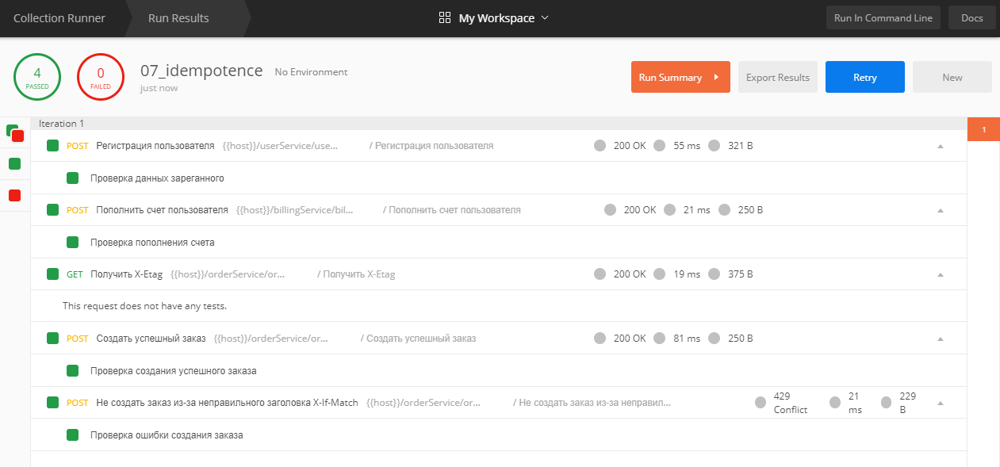

# Идемпотетность

На основе [предыдущей домашки](https://github.com/AntonZylyov/microservices_architect/tree/master/06) сделан вариант
с идемпотентным оформлением заказа. 

Идемпотентность реализована на основе заголовков `X-Etag` / `X-If-Match` 
(со стандартными заголовками `Etag` и `If-Match` не завелось, похоже их ingress gateway вырезает).


## Запуск

Если неймспейса myapp нет, создать его:

```
kubectl create namespace myapp
```

Если встроенный ingress не активирован, надо активировать его:

```
minikube addons enable ingress
```

Установить приложение из helm:

```
helm install mysuperapp ./helm -n myapp
```


Теперь приложение доступно тут: 

Регистрация http://bit.homework/userService/user/regitser
 
Создание заказа http://bit.homework/orderService/order/create

 

## Тесты в постмане

Написаны и работают. Иcходники [тут](postman/collection.json).
Картинка для тех кто не будет их запускать сам:



 
