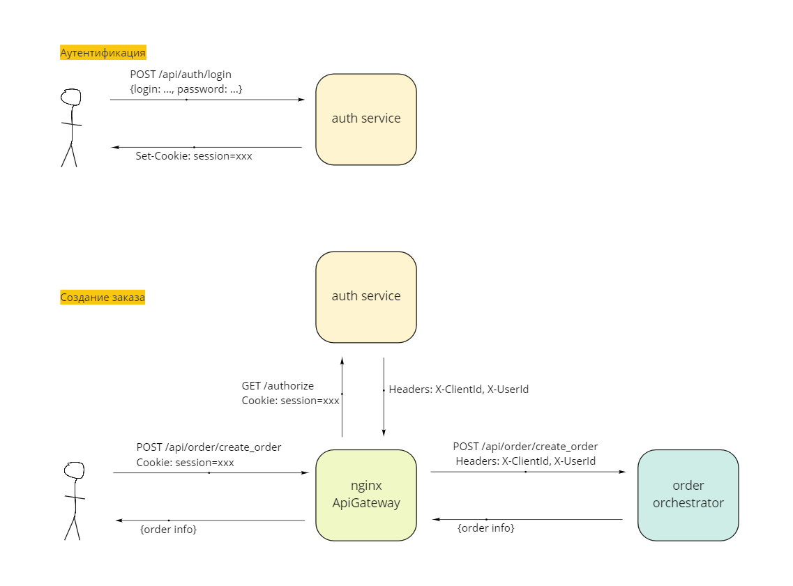
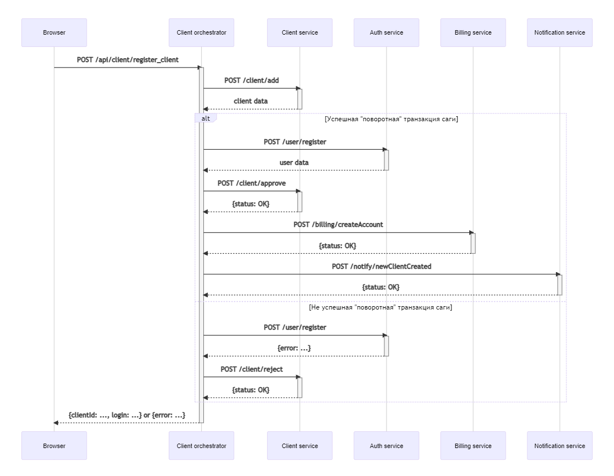
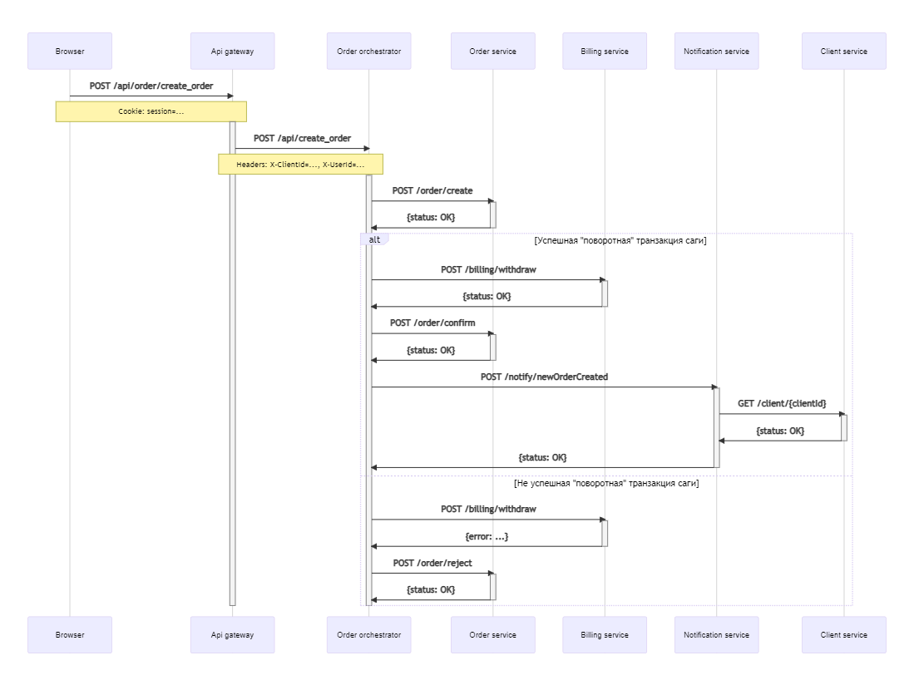
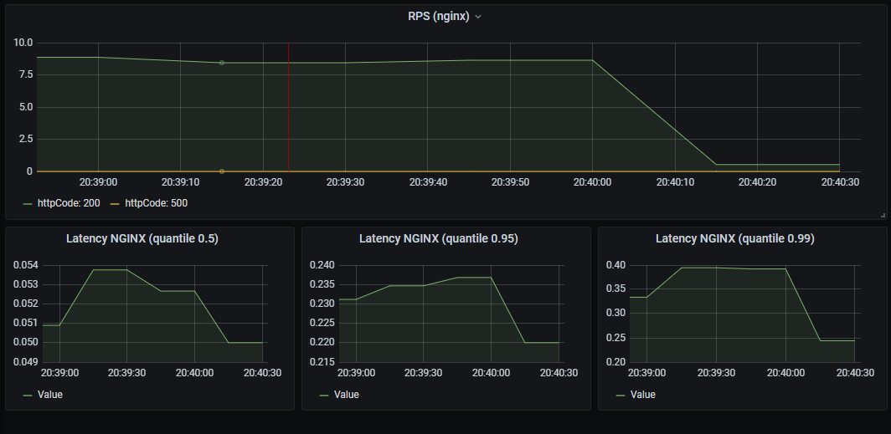
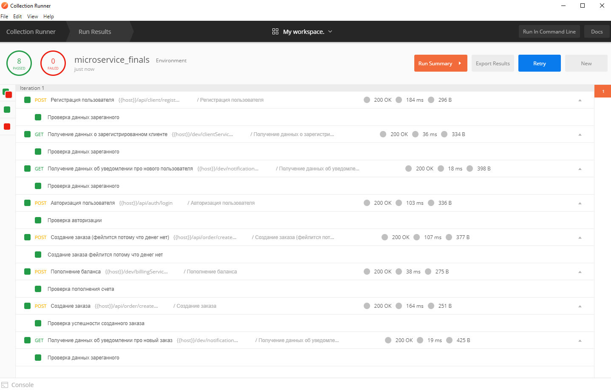

# Архитектор программного обеспечения
Квинтэссенция всех [предыдущих домашек](homeworks.md) объединенная в одном прекрасном итоговом наборе микросервисов.

В этой работе:

* [Api gateway](#api_gateway)
* [Обеспечение идемпотентности](#idemponence)
* [Взаимодействие микросервисов](#interaction)
* [Сага и оркестратор](#saga)
* [Мониторинг и алертинг](#monitoring)
* Пара слов о тонкостях реализации???
* [Запуск](#run)

___

## <a name="api_gateway"></a> Api gateway
Всего в системе запускается три ингреса: 
* [ингрес для авторизации](final/helm/templates/auth-ingress.yaml)
* [ингрес для создания заказа](final/helm/templates/order-ingress.yaml)
* [dev ингрес](final/helm/templates/dev-ingress.yaml) являющий собой бекдор для доступа к сервисам напрямую мимо оркестратора. Он нужен для тестов постмана. 

Так вот ингрес для создания заказа использует Api gateway. 
Запрос к `/api/create_order` подразумевает передачу сессионной куки, на основании которой происходит аутентификация 
и дальше в оркестратор создания заказа пробрасываются заголовки `X-ClientId` и `X-UserId`.



## <a name="idemponence"></a> Обеспечение идемпотентности
Ко всем межсервисным запросам добавляется специальный заголовок `X-Request-Id` (см. [исходники](https://github.com/AntonZylyov/base_microservice/blob/master/src/Service.php#L28)).
Запросы, требующие идемпотентности, сохраняют этот `requestId` и при повторных запросах с тем же `requestId`, игнорируют их (см. [еще исходники](final/docker/auth_service/src/public/index.php#L149)).

Повторные запросы производятся в случае, если очередной запрос возвращает так называемую инфраструктурную ошибку (400-е и 500-е статусы ответа). 

Сниппет кода, для большего понимания:
```php
public function request(string $url): Result
{
    $headers = [
        'X-Request-Id' => bin2hex(random_bytes(16)),
    ];

    $tryCount = 0;
    do
    {
        $tryCount++;
        $result = $this->doRequest($url, $headers);
        if ($result->isSuccess() || !$result->hasInfrastructureError())
        {
            break;
        }
        usleep(RETRY_DELAY);
    }
    while ($tryCount <= RETRY_COUNT);

    return $result;
}
``` 

## <a name="interaction"></a> Взаимодействие микросервисов


## <a name="saga"></a> Сага и оркестратор
В системе используется сага с оркестровкой, когда для исполнения саги есть отдельный сервис-оркестратор,
отвечающий за выполнение отдельных шагов этой саги.

Все было сделано два сервиса-оркестратора:

### Оркестратор регистрации клиента (Client orchestrator)

| Шаг | Сервис               | Транзакция                               | Компенсирующая транзакция |
|-----|----------------------|----------------------------------------  |---------------------------|
| 1   | Client service       | /client/add                              | /client/reject            |
| 2   | Auth service         | /user/register _(поворотная транзакция)_ | -                         |
| 3   | Client service       | /client/approve                          | -                         |
| 4   | Billing service      | /billing/createAccount                   | -                         |
| 5   | Notification service | /notify/newClientCreated                 | -                         |

Диаграмма взаимодействия сервисов ([Исходники диаграммы тут](https://mermaid-js.github.io/mermaid-live-editor/edit/#eyJjb2RlIjoic2VxdWVuY2VEaWFncmFtXG5cbnBhcnRpY2lwYW50IEJyb3dzZXJcbnBhcnRpY2lwYW50IENsaWVudCBvcmNoZXN0cmF0b3JcbnBhcnRpY2lwYW50IENsaWVudCBzZXJ2aWNlXG5wYXJ0aWNpcGFudCBBdXRoIHNlcnZpY2VcbnBhcnRpY2lwYW50IEJpbGxpbmcgc2VydmljZVxucGFydGljaXBhbnQgTm90aWZpY2F0aW9uIHNlcnZpY2VcblxuQnJvd3Nlci0-PkNsaWVudCBvcmNoZXN0cmF0b3I6IFBPU1QgL2FwaS9jbGllbnQvcmVnaXN0ZXJfY2xpZW50XG5hY3RpdmF0ZSBDbGllbnQgb3JjaGVzdHJhdG9yXG4gICAgQ2xpZW50IG9yY2hlc3RyYXRvci0-PkNsaWVudCBzZXJ2aWNlOiBQT1NUIC9jbGllbnQvYWRkXG4gICAgYWN0aXZhdGUgQ2xpZW50IHNlcnZpY2VcbiAgICBDbGllbnQgc2VydmljZS0tPj5DbGllbnQgb3JjaGVzdHJhdG9yOiBjbGllbnQgZGF0YVxuICAgIGRlYWN0aXZhdGUgQ2xpZW50IHNlcnZpY2VcblxuICAgIGFsdCDQo9GB0L_QtdGI0L3QsNGPIFwi0L_QvtCy0L7RgNC-0YLQvdCw0Y9cIiDRgtGA0LDQvdC30LDQutGG0LjRjyDRgdCw0LPQuFxuICAgICAgICBDbGllbnQgb3JjaGVzdHJhdG9yLT4-QXV0aCBzZXJ2aWNlOiBQT1NUIC91c2VyL3JlZ2lzdGVyXG4gICAgICAgIGFjdGl2YXRlIEF1dGggc2VydmljZVxuICAgICAgICBBdXRoIHNlcnZpY2UtLT4-Q2xpZW50IG9yY2hlc3RyYXRvcjogdXNlciBkYXRhXG4gICAgICAgIGRlYWN0aXZhdGUgQXV0aCBzZXJ2aWNlXG5cbiAgICAgICAgQ2xpZW50IG9yY2hlc3RyYXRvci0-PkNsaWVudCBzZXJ2aWNlOiBQT1NUIC9jbGllbnQvYXBwcm92ZVxuICAgICAgICBhY3RpdmF0ZSBDbGllbnQgc2VydmljZVxuICAgICAgICBDbGllbnQgc2VydmljZS0tPj5DbGllbnQgb3JjaGVzdHJhdG9yOiB7c3RhdHVzOiBPS31cbiAgICAgICAgZGVhY3RpdmF0ZSBDbGllbnQgc2VydmljZVxuXG4gICAgICAgIENsaWVudCBvcmNoZXN0cmF0b3ItPj5CaWxsaW5nIHNlcnZpY2U6IFBPU1QgL2JpbGxpbmcvY3JlYXRlQWNjb3VudFxuICAgICAgICBhY3RpdmF0ZSBCaWxsaW5nIHNlcnZpY2VcbiAgICAgICAgQmlsbGluZyBzZXJ2aWNlLS0-PkNsaWVudCBvcmNoZXN0cmF0b3I6IHtzdGF0dXM6IE9LfVxuICAgICAgICBkZWFjdGl2YXRlIEJpbGxpbmcgc2VydmljZVxuXG4gICAgICAgIENsaWVudCBvcmNoZXN0cmF0b3ItPj5Ob3RpZmljYXRpb24gc2VydmljZTogUE9TVCAvbm90aWZ5L25ld0NsaWVudENyZWF0ZWRcbiAgICAgICAgYWN0aXZhdGUgTm90aWZpY2F0aW9uIHNlcnZpY2VcbiAgICAgICAgTm90aWZpY2F0aW9uIHNlcnZpY2UtLT4-Q2xpZW50IG9yY2hlc3RyYXRvcjoge3N0YXR1czogT0t9XG4gICAgICAgIGRlYWN0aXZhdGUgTm90aWZpY2F0aW9uIHNlcnZpY2VcbiAgICBlbHNlINCd0LUg0YPRgdC_0LXRiNC90LDRjyBcItC_0L7QstC-0YDQvtGC0L3QsNGPXCIg0YLRgNCw0L3Qt9Cw0LrRhtC40Y8g0YHQsNCz0LhcbiAgICAgICAgQ2xpZW50IG9yY2hlc3RyYXRvci0-PkF1dGggc2VydmljZTogUE9TVCAvdXNlci9yZWdpc3RlclxuICAgICAgICBhY3RpdmF0ZSBBdXRoIHNlcnZpY2VcbiAgICAgICAgQXV0aCBzZXJ2aWNlLS0-PkNsaWVudCBvcmNoZXN0cmF0b3I6IHtlcnJvcjogLi4ufVxuICAgICAgICBkZWFjdGl2YXRlIEF1dGggc2VydmljZVxuXG4gICAgICAgIENsaWVudCBvcmNoZXN0cmF0b3ItPj5DbGllbnQgc2VydmljZTogUE9TVCAvY2xpZW50L3JlamVjdFxuICAgICAgICBhY3RpdmF0ZSBDbGllbnQgc2VydmljZVxuICAgICAgICBDbGllbnQgc2VydmljZS0tPj5DbGllbnQgb3JjaGVzdHJhdG9yOiB7c3RhdHVzOiBPS31cbiAgICAgICAgZGVhY3RpdmF0ZSBDbGllbnQgc2VydmljZVxuICAgIGVuZFxuXG5DbGllbnQgb3JjaGVzdHJhdG9yLS0-PkJyb3dzZXI6IHtjbGllbnRJZDogLi4uLCBsb2dpbjogLi4ufSBvciB7ZXJyb3I6IC4uLn1cbmRlYWN0aXZhdGUgQ2xpZW50IG9yY2hlc3RyYXRvciIsIm1lcm1haWQiOiJ7XG4gIFwidGhlbWVcIjogXCJkZWZhdWx0XCIsXG4gIFwidGhlbWVWYXJpYWJsZXNcIjoge1xuICAgIFwiYmFja2dyb3VuZFwiOiBcIndoaXRlXCIsXG4gICAgXCJwcmltYXJ5Q29sb3JcIjogXCIjRUNFQ0ZGXCIsXG4gICAgXCJzZWNvbmRhcnlDb2xvclwiOiBcIiNmZmZmZGVcIixcbiAgICBcInRlcnRpYXJ5Q29sb3JcIjogXCJoc2woODAsIDEwMCUsIDk2LjI3NDUwOTgwMzklKVwiLFxuICAgIFwicHJpbWFyeUJvcmRlckNvbG9yXCI6IFwiaHNsKDI0MCwgNjAlLCA4Ni4yNzQ1MDk4MDM5JSlcIixcbiAgICBcInNlY29uZGFyeUJvcmRlckNvbG9yXCI6IFwiaHNsKDYwLCA2MCUsIDgzLjUyOTQxMTc2NDclKVwiLFxuICAgIFwidGVydGlhcnlCb3JkZXJDb2xvclwiOiBcImhzbCg4MCwgNjAlLCA4Ni4yNzQ1MDk4MDM5JSlcIixcbiAgICBcInByaW1hcnlUZXh0Q29sb3JcIjogXCIjMTMxMzAwXCIsXG4gICAgXCJzZWNvbmRhcnlUZXh0Q29sb3JcIjogXCIjMDAwMDIxXCIsXG4gICAgXCJ0ZXJ0aWFyeVRleHRDb2xvclwiOiBcInJnYig5LjUwMDAwMDAwMDEsIDkuNTAwMDAwMDAwMSwgOS41MDAwMDAwMDAxKVwiLFxuICAgIFwibGluZUNvbG9yXCI6IFwiIzMzMzMzM1wiLFxuICAgIFwidGV4dENvbG9yXCI6IFwiIzMzM1wiLFxuICAgIFwibWFpbkJrZ1wiOiBcIiNFQ0VDRkZcIixcbiAgICBcInNlY29uZEJrZ1wiOiBcIiNmZmZmZGVcIixcbiAgICBcImJvcmRlcjFcIjogXCIjOTM3MERCXCIsXG4gICAgXCJib3JkZXIyXCI6IFwiI2FhYWEzM1wiLFxuICAgIFwiYXJyb3doZWFkQ29sb3JcIjogXCIjMzMzMzMzXCIsXG4gICAgXCJmb250RmFtaWx5XCI6IFwiXFxcInRyZWJ1Y2hldCBtc1xcXCIsIHZlcmRhbmEsIGFyaWFsXCIsXG4gICAgXCJmb250U2l6ZVwiOiBcIjE2cHhcIixcbiAgICBcImxhYmVsQmFja2dyb3VuZFwiOiBcIiNlOGU4ZThcIixcbiAgICBcIm5vZGVCa2dcIjogXCIjRUNFQ0ZGXCIsXG4gICAgXCJub2RlQm9yZGVyXCI6IFwiIzkzNzBEQlwiLFxuICAgIFwiY2x1c3RlckJrZ1wiOiBcIiNmZmZmZGVcIixcbiAgICBcImNsdXN0ZXJCb3JkZXJcIjogXCIjYWFhYTMzXCIsXG4gICAgXCJkZWZhdWx0TGlua0NvbG9yXCI6IFwiIzMzMzMzM1wiLFxuICAgIFwidGl0bGVDb2xvclwiOiBcIiMzMzNcIixcbiAgICBcImVkZ2VMYWJlbEJhY2tncm91bmRcIjogXCIjZThlOGU4XCIsXG4gICAgXCJhY3RvckJvcmRlclwiOiBcImhzbCgyNTkuNjI2MTY4MjI0MywgNTkuNzc2NTM2MzEyOCUsIDg3LjkwMTk2MDc4NDMlKVwiLFxuICAgIFwiYWN0b3JCa2dcIjogXCIjRUNFQ0ZGXCIsXG4gICAgXCJhY3RvclRleHRDb2xvclwiOiBcImJsYWNrXCIsXG4gICAgXCJhY3RvckxpbmVDb2xvclwiOiBcImdyZXlcIixcbiAgICBcInNpZ25hbENvbG9yXCI6IFwiIzMzM1wiLFxuICAgIFwic2lnbmFsVGV4dENvbG9yXCI6IFwiIzMzM1wiLFxuICAgIFwibGFiZWxCb3hCa2dDb2xvclwiOiBcIiNFQ0VDRkZcIixcbiAgICBcImxhYmVsQm94Qm9yZGVyQ29sb3JcIjogXCJoc2woMjU5LjYyNjE2ODIyNDMsIDU5Ljc3NjUzNjMxMjglLCA4Ny45MDE5NjA3ODQzJSlcIixcbiAgICBcImxhYmVsVGV4dENvbG9yXCI6IFwiYmxhY2tcIixcbiAgICBcImxvb3BUZXh0Q29sb3JcIjogXCJibGFja1wiLFxuICAgIFwibm90ZUJvcmRlckNvbG9yXCI6IFwiI2FhYWEzM1wiLFxuICAgIFwibm90ZUJrZ0NvbG9yXCI6IFwiI2ZmZjVhZFwiLFxuICAgIFwibm90ZVRleHRDb2xvclwiOiBcImJsYWNrXCIsXG4gICAgXCJhY3RpdmF0aW9uQm9yZGVyQ29sb3JcIjogXCIjNjY2XCIsXG4gICAgXCJhY3RpdmF0aW9uQmtnQ29sb3JcIjogXCIjZjRmNGY0XCIsXG4gICAgXCJzZXF1ZW5jZU51bWJlckNvbG9yXCI6IFwid2hpdGVcIixcbiAgICBcInNlY3Rpb25Ca2dDb2xvclwiOiBcInJnYmEoMTAyLCAxMDIsIDI1NSwgMC40OSlcIixcbiAgICBcImFsdFNlY3Rpb25Ca2dDb2xvclwiOiBcIndoaXRlXCIsXG4gICAgXCJzZWN0aW9uQmtnQ29sb3IyXCI6IFwiI2ZmZjQwMFwiLFxuICAgIFwidGFza0JvcmRlckNvbG9yXCI6IFwiIzUzNGZiY1wiLFxuICAgIFwidGFza0JrZ0NvbG9yXCI6IFwiIzhhOTBkZFwiLFxuICAgIFwidGFza1RleHRMaWdodENvbG9yXCI6IFwid2hpdGVcIixcbiAgICBcInRhc2tUZXh0Q29sb3JcIjogXCJ3aGl0ZVwiLFxuICAgIFwidGFza1RleHREYXJrQ29sb3JcIjogXCJibGFja1wiLFxuICAgIFwidGFza1RleHRPdXRzaWRlQ29sb3JcIjogXCJibGFja1wiLFxuICAgIFwidGFza1RleHRDbGlja2FibGVDb2xvclwiOiBcIiMwMDMxNjNcIixcbiAgICBcImFjdGl2ZVRhc2tCb3JkZXJDb2xvclwiOiBcIiM1MzRmYmNcIixcbiAgICBcImFjdGl2ZVRhc2tCa2dDb2xvclwiOiBcIiNiZmM3ZmZcIixcbiAgICBcImdyaWRDb2xvclwiOiBcImxpZ2h0Z3JleVwiLFxuICAgIFwiZG9uZVRhc2tCa2dDb2xvclwiOiBcImxpZ2h0Z3JleVwiLFxuICAgIFwiZG9uZVRhc2tCb3JkZXJDb2xvclwiOiBcImdyZXlcIixcbiAgICBcImNyaXRCb3JkZXJDb2xvclwiOiBcIiNmZjg4ODhcIixcbiAgICBcImNyaXRCa2dDb2xvclwiOiBcInJlZFwiLFxuICAgIFwidG9kYXlMaW5lQ29sb3JcIjogXCJyZWRcIixcbiAgICBcImxhYmVsQ29sb3JcIjogXCJibGFja1wiLFxuICAgIFwiZXJyb3JCa2dDb2xvclwiOiBcIiM1NTIyMjJcIixcbiAgICBcImVycm9yVGV4dENvbG9yXCI6IFwiIzU1MjIyMlwiLFxuICAgIFwiY2xhc3NUZXh0XCI6IFwiIzEzMTMwMFwiLFxuICAgIFwiZmlsbFR5cGUwXCI6IFwiI0VDRUNGRlwiLFxuICAgIFwiZmlsbFR5cGUxXCI6IFwiI2ZmZmZkZVwiLFxuICAgIFwiZmlsbFR5cGUyXCI6IFwiaHNsKDMwNCwgMTAwJSwgOTYuMjc0NTA5ODAzOSUpXCIsXG4gICAgXCJmaWxsVHlwZTNcIjogXCJoc2woMTI0LCAxMDAlLCA5My41Mjk0MTE3NjQ3JSlcIixcbiAgICBcImZpbGxUeXBlNFwiOiBcImhzbCgxNzYsIDEwMCUsIDk2LjI3NDUwOTgwMzklKVwiLFxuICAgIFwiZmlsbFR5cGU1XCI6IFwiaHNsKC00LCAxMDAlLCA5My41Mjk0MTE3NjQ3JSlcIixcbiAgICBcImZpbGxUeXBlNlwiOiBcImhzbCg4LCAxMDAlLCA5Ni4yNzQ1MDk4MDM5JSlcIixcbiAgICBcImZpbGxUeXBlN1wiOiBcImhzbCgxODgsIDEwMCUsIDkzLjUyOTQxMTc2NDclKVwiXG4gIH1cbn0iLCJ1cGRhdGVFZGl0b3IiOmZhbHNlLCJhdXRvU3luYyI6dHJ1ZSwidXBkYXRlRGlhZ3JhbSI6ZmFsc2V9)):




### Оркестратор создания заказа (Order orchestrator)

| Шаг | Сервис               | Транзакция                                  | Компенсирующая транзакция |
|-----|----------------------|---------------------------------------------|---------------------------|
| 1   | Order service        | /order/create                               | /order/reject             |
| 2   | Billing service      | /billing/withdraw _(поворотная транзакция)_ | -                         |
| 3   | Order service        | /order/confirm                              | -                         |
| 5   | Notification service | /notify/newOrderCreated                     | -                         |

Диаграмма взаимодействия сервисов ([Исходники диаграммы тут](https://mermaid-js.github.io/mermaid-live-editor/edit/#eyJjb2RlIjoic2VxdWVuY2VEaWFncmFtXG5cbnBhcnRpY2lwYW50IEJyb3dzZXJcbnBhcnRpY2lwYW50IEFwaSBnYXRld2F5XG5wYXJ0aWNpcGFudCBPcmRlciBvcmNoZXN0cmF0b3JcbnBhcnRpY2lwYW50IE9yZGVyIHNlcnZpY2VcbnBhcnRpY2lwYW50IEJpbGxpbmcgc2VydmljZVxucGFydGljaXBhbnQgTm90aWZpY2F0aW9uIHNlcnZpY2VcbnBhcnRpY2lwYW50IENsaWVudCBzZXJ2aWNlXG5cbkJyb3dzZXItPj5BcGkgZ2F0ZXdheTogUE9TVCAvYXBpL29yZGVyL2NyZWF0ZV9vcmRlclxuTm90ZSBvdmVyIEJyb3dzZXIsIEFwaSBnYXRld2F5OiBDb29raWU6IHNlc3Npb249Li4uXG5hY3RpdmF0ZSBBcGkgZ2F0ZXdheVxuICAgIEFwaSBnYXRld2F5LT4-T3JkZXIgb3JjaGVzdHJhdG9yOiBQT1NUIC9hcGkvY3JlYXRlX29yZGVyXG4gICAgTm90ZSBvdmVyIEFwaSBnYXRld2F5LE9yZGVyIG9yY2hlc3RyYXRvcjogSGVhZGVyczogWC1DbGllbnRJZD0uLi4sIFgtVXNlcklkPS4uLlxuICAgIGFjdGl2YXRlIE9yZGVyIG9yY2hlc3RyYXRvclxuICAgICAgICBPcmRlciBvcmNoZXN0cmF0b3ItPj5PcmRlciBzZXJ2aWNlOiBQT1NUIC9vcmRlci9jcmVhdGVcbiAgICAgICAgYWN0aXZhdGUgT3JkZXIgc2VydmljZVxuICAgICAgICBPcmRlciBzZXJ2aWNlLT4-T3JkZXIgb3JjaGVzdHJhdG9yOiB7c3RhdHVzOiBPS31cbiAgICAgICAgZGVhY3RpdmF0ZSBPcmRlciBzZXJ2aWNlXG4gICAgICAgIGFsdCDQo9GB0L_QtdGI0L3QsNGPIFwi0L_QvtCy0L7RgNC-0YLQvdCw0Y9cIiDRgtGA0LDQvdC30LDQutGG0LjRjyDRgdCw0LPQuFxuICAgICAgICAgICAgT3JkZXIgb3JjaGVzdHJhdG9yLT4-QmlsbGluZyBzZXJ2aWNlOiBQT1NUIC9iaWxsaW5nL3dpdGhkcmF3XG4gICAgICAgICAgICBhY3RpdmF0ZSBCaWxsaW5nIHNlcnZpY2VcbiAgICAgICAgICAgIEJpbGxpbmcgc2VydmljZS0-Pk9yZGVyIG9yY2hlc3RyYXRvcjoge3N0YXR1czogT0t9XG4gICAgICAgICAgICBkZWFjdGl2YXRlIEJpbGxpbmcgc2VydmljZVxuXG4gICAgICAgICAgICBPcmRlciBvcmNoZXN0cmF0b3ItPj5PcmRlciBzZXJ2aWNlOiBQT1NUIC9vcmRlci9jb25maXJtXG4gICAgICAgICAgICBhY3RpdmF0ZSBPcmRlciBzZXJ2aWNlXG4gICAgICAgICAgICBPcmRlciBzZXJ2aWNlLT4-T3JkZXIgb3JjaGVzdHJhdG9yOiB7c3RhdHVzOiBPS31cbiAgICAgICAgICAgIGRlYWN0aXZhdGUgT3JkZXIgc2VydmljZVxuXG4gICAgICAgICAgICBPcmRlciBvcmNoZXN0cmF0b3ItPj5Ob3RpZmljYXRpb24gc2VydmljZTogUE9TVCAvbm90aWZ5L25ld09yZGVyQ3JlYXRlZFxuICAgICAgICAgICAgYWN0aXZhdGUgTm90aWZpY2F0aW9uIHNlcnZpY2VcbiAgICAgICAgICAgICAgICBOb3RpZmljYXRpb24gc2VydmljZS0-PkNsaWVudCBzZXJ2aWNlOiBHRVQgL2NsaWVudC97Y2xpZW50SWR9XG4gICAgICAgICAgICAgICAgYWN0aXZhdGUgQ2xpZW50IHNlcnZpY2VcbiAgICAgICAgICAgICAgICBDbGllbnQgc2VydmljZS0-Pk5vdGlmaWNhdGlvbiBzZXJ2aWNlOiB7c3RhdHVzOiBPS31cbiAgICAgICAgICAgICAgICBkZWFjdGl2YXRlIENsaWVudCBzZXJ2aWNlXG5cbiAgICAgICAgICAgIE5vdGlmaWNhdGlvbiBzZXJ2aWNlLT4-T3JkZXIgb3JjaGVzdHJhdG9yOiB7c3RhdHVzOiBPS31cbiAgICAgICAgICAgIGRlYWN0aXZhdGUgTm90aWZpY2F0aW9uIHNlcnZpY2VcblxuICAgICAgICBlbHNlINCd0LUg0YPRgdC_0LXRiNC90LDRjyBcItC_0L7QstC-0YDQvtGC0L3QsNGPXCIg0YLRgNCw0L3Qt9Cw0LrRhtC40Y8g0YHQsNCz0LhcbiAgICAgICAgICAgIE9yZGVyIG9yY2hlc3RyYXRvci0-PkJpbGxpbmcgc2VydmljZTogUE9TVCAvYmlsbGluZy93aXRoZHJhd1xuICAgICAgICAgICAgYWN0aXZhdGUgQmlsbGluZyBzZXJ2aWNlXG4gICAgICAgICAgICBCaWxsaW5nIHNlcnZpY2UtPj5PcmRlciBvcmNoZXN0cmF0b3I6IHtlcnJvcjogLi4ufVxuICAgICAgICAgICAgZGVhY3RpdmF0ZSBCaWxsaW5nIHNlcnZpY2VcblxuICAgICAgICAgICAgT3JkZXIgb3JjaGVzdHJhdG9yLT4-T3JkZXIgc2VydmljZTogUE9TVCAvb3JkZXIvcmVqZWN0XG4gICAgICAgICAgICBhY3RpdmF0ZSBPcmRlciBzZXJ2aWNlXG4gICAgICAgICAgICBPcmRlciBzZXJ2aWNlLT4-T3JkZXIgb3JjaGVzdHJhdG9yOiB7c3RhdHVzOiBPS31cbiAgICAgICAgICAgIGRlYWN0aXZhdGUgT3JkZXIgc2VydmljZVxuICAgICAgICBlbmRcbiAgICBkZWFjdGl2YXRlIE9yZGVyIG9yY2hlc3RyYXRvclxuXG5kZWFjdGl2YXRlIEFwaSBnYXRld2F5IiwibWVybWFpZCI6IntcbiAgXCJ0aGVtZVwiOiBcImRlZmF1bHRcIixcbiAgXCJ0aGVtZVZhcmlhYmxlc1wiOiB7XG4gICAgXCJiYWNrZ3JvdW5kXCI6IFwid2hpdGVcIixcbiAgICBcInByaW1hcnlDb2xvclwiOiBcIiNFQ0VDRkZcIixcbiAgICBcInNlY29uZGFyeUNvbG9yXCI6IFwiI2ZmZmZkZVwiLFxuICAgIFwidGVydGlhcnlDb2xvclwiOiBcImhzbCg4MCwgMTAwJSwgOTYuMjc0NTA5ODAzOSUpXCIsXG4gICAgXCJwcmltYXJ5Qm9yZGVyQ29sb3JcIjogXCJoc2woMjQwLCA2MCUsIDg2LjI3NDUwOTgwMzklKVwiLFxuICAgIFwic2Vjb25kYXJ5Qm9yZGVyQ29sb3JcIjogXCJoc2woNjAsIDYwJSwgODMuNTI5NDExNzY0NyUpXCIsXG4gICAgXCJ0ZXJ0aWFyeUJvcmRlckNvbG9yXCI6IFwiaHNsKDgwLCA2MCUsIDg2LjI3NDUwOTgwMzklKVwiLFxuICAgIFwicHJpbWFyeVRleHRDb2xvclwiOiBcIiMxMzEzMDBcIixcbiAgICBcInNlY29uZGFyeVRleHRDb2xvclwiOiBcIiMwMDAwMjFcIixcbiAgICBcInRlcnRpYXJ5VGV4dENvbG9yXCI6IFwicmdiKDkuNTAwMDAwMDAwMSwgOS41MDAwMDAwMDAxLCA5LjUwMDAwMDAwMDEpXCIsXG4gICAgXCJsaW5lQ29sb3JcIjogXCIjMzMzMzMzXCIsXG4gICAgXCJ0ZXh0Q29sb3JcIjogXCIjMzMzXCIsXG4gICAgXCJtYWluQmtnXCI6IFwiI0VDRUNGRlwiLFxuICAgIFwic2Vjb25kQmtnXCI6IFwiI2ZmZmZkZVwiLFxuICAgIFwiYm9yZGVyMVwiOiBcIiM5MzcwREJcIixcbiAgICBcImJvcmRlcjJcIjogXCIjYWFhYTMzXCIsXG4gICAgXCJhcnJvd2hlYWRDb2xvclwiOiBcIiMzMzMzMzNcIixcbiAgICBcImZvbnRGYW1pbHlcIjogXCJcXFwidHJlYnVjaGV0IG1zXFxcIiwgdmVyZGFuYSwgYXJpYWxcIixcbiAgICBcImZvbnRTaXplXCI6IFwiMTZweFwiLFxuICAgIFwibGFiZWxCYWNrZ3JvdW5kXCI6IFwiI2U4ZThlOFwiLFxuICAgIFwibm9kZUJrZ1wiOiBcIiNFQ0VDRkZcIixcbiAgICBcIm5vZGVCb3JkZXJcIjogXCIjOTM3MERCXCIsXG4gICAgXCJjbHVzdGVyQmtnXCI6IFwiI2ZmZmZkZVwiLFxuICAgIFwiY2x1c3RlckJvcmRlclwiOiBcIiNhYWFhMzNcIixcbiAgICBcImRlZmF1bHRMaW5rQ29sb3JcIjogXCIjMzMzMzMzXCIsXG4gICAgXCJ0aXRsZUNvbG9yXCI6IFwiIzMzM1wiLFxuICAgIFwiZWRnZUxhYmVsQmFja2dyb3VuZFwiOiBcIiNlOGU4ZThcIixcbiAgICBcImFjdG9yQm9yZGVyXCI6IFwiaHNsKDI1OS42MjYxNjgyMjQzLCA1OS43NzY1MzYzMTI4JSwgODcuOTAxOTYwNzg0MyUpXCIsXG4gICAgXCJhY3RvckJrZ1wiOiBcIiNFQ0VDRkZcIixcbiAgICBcImFjdG9yVGV4dENvbG9yXCI6IFwiYmxhY2tcIixcbiAgICBcImFjdG9yTGluZUNvbG9yXCI6IFwiZ3JleVwiLFxuICAgIFwic2lnbmFsQ29sb3JcIjogXCIjMzMzXCIsXG4gICAgXCJzaWduYWxUZXh0Q29sb3JcIjogXCIjMzMzXCIsXG4gICAgXCJsYWJlbEJveEJrZ0NvbG9yXCI6IFwiI0VDRUNGRlwiLFxuICAgIFwibGFiZWxCb3hCb3JkZXJDb2xvclwiOiBcImhzbCgyNTkuNjI2MTY4MjI0MywgNTkuNzc2NTM2MzEyOCUsIDg3LjkwMTk2MDc4NDMlKVwiLFxuICAgIFwibGFiZWxUZXh0Q29sb3JcIjogXCJibGFja1wiLFxuICAgIFwibG9vcFRleHRDb2xvclwiOiBcImJsYWNrXCIsXG4gICAgXCJub3RlQm9yZGVyQ29sb3JcIjogXCIjYWFhYTMzXCIsXG4gICAgXCJub3RlQmtnQ29sb3JcIjogXCIjZmZmNWFkXCIsXG4gICAgXCJub3RlVGV4dENvbG9yXCI6IFwiYmxhY2tcIixcbiAgICBcImFjdGl2YXRpb25Cb3JkZXJDb2xvclwiOiBcIiM2NjZcIixcbiAgICBcImFjdGl2YXRpb25Ca2dDb2xvclwiOiBcIiNmNGY0ZjRcIixcbiAgICBcInNlcXVlbmNlTnVtYmVyQ29sb3JcIjogXCJ3aGl0ZVwiLFxuICAgIFwic2VjdGlvbkJrZ0NvbG9yXCI6IFwicmdiYSgxMDIsIDEwMiwgMjU1LCAwLjQ5KVwiLFxuICAgIFwiYWx0U2VjdGlvbkJrZ0NvbG9yXCI6IFwid2hpdGVcIixcbiAgICBcInNlY3Rpb25Ca2dDb2xvcjJcIjogXCIjZmZmNDAwXCIsXG4gICAgXCJ0YXNrQm9yZGVyQ29sb3JcIjogXCIjNTM0ZmJjXCIsXG4gICAgXCJ0YXNrQmtnQ29sb3JcIjogXCIjOGE5MGRkXCIsXG4gICAgXCJ0YXNrVGV4dExpZ2h0Q29sb3JcIjogXCJ3aGl0ZVwiLFxuICAgIFwidGFza1RleHRDb2xvclwiOiBcIndoaXRlXCIsXG4gICAgXCJ0YXNrVGV4dERhcmtDb2xvclwiOiBcImJsYWNrXCIsXG4gICAgXCJ0YXNrVGV4dE91dHNpZGVDb2xvclwiOiBcImJsYWNrXCIsXG4gICAgXCJ0YXNrVGV4dENsaWNrYWJsZUNvbG9yXCI6IFwiIzAwMzE2M1wiLFxuICAgIFwiYWN0aXZlVGFza0JvcmRlckNvbG9yXCI6IFwiIzUzNGZiY1wiLFxuICAgIFwiYWN0aXZlVGFza0JrZ0NvbG9yXCI6IFwiI2JmYzdmZlwiLFxuICAgIFwiZ3JpZENvbG9yXCI6IFwibGlnaHRncmV5XCIsXG4gICAgXCJkb25lVGFza0JrZ0NvbG9yXCI6IFwibGlnaHRncmV5XCIsXG4gICAgXCJkb25lVGFza0JvcmRlckNvbG9yXCI6IFwiZ3JleVwiLFxuICAgIFwiY3JpdEJvcmRlckNvbG9yXCI6IFwiI2ZmODg4OFwiLFxuICAgIFwiY3JpdEJrZ0NvbG9yXCI6IFwicmVkXCIsXG4gICAgXCJ0b2RheUxpbmVDb2xvclwiOiBcInJlZFwiLFxuICAgIFwibGFiZWxDb2xvclwiOiBcImJsYWNrXCIsXG4gICAgXCJlcnJvckJrZ0NvbG9yXCI6IFwiIzU1MjIyMlwiLFxuICAgIFwiZXJyb3JUZXh0Q29sb3JcIjogXCIjNTUyMjIyXCIsXG4gICAgXCJjbGFzc1RleHRcIjogXCIjMTMxMzAwXCIsXG4gICAgXCJmaWxsVHlwZTBcIjogXCIjRUNFQ0ZGXCIsXG4gICAgXCJmaWxsVHlwZTFcIjogXCIjZmZmZmRlXCIsXG4gICAgXCJmaWxsVHlwZTJcIjogXCJoc2woMzA0LCAxMDAlLCA5Ni4yNzQ1MDk4MDM5JSlcIixcbiAgICBcImZpbGxUeXBlM1wiOiBcImhzbCgxMjQsIDEwMCUsIDkzLjUyOTQxMTc2NDclKVwiLFxuICAgIFwiZmlsbFR5cGU0XCI6IFwiaHNsKDE3NiwgMTAwJSwgOTYuMjc0NTA5ODAzOSUpXCIsXG4gICAgXCJmaWxsVHlwZTVcIjogXCJoc2woLTQsIDEwMCUsIDkzLjUyOTQxMTc2NDclKVwiLFxuICAgIFwiZmlsbFR5cGU2XCI6IFwiaHNsKDgsIDEwMCUsIDk2LjI3NDUwOTgwMzklKVwiLFxuICAgIFwiZmlsbFR5cGU3XCI6IFwiaHNsKDE4OCwgMTAwJSwgOTMuNTI5NDExNzY0NyUpXCJcbiAgfVxufSIsInVwZGF0ZUVkaXRvciI6ZmFsc2UsImF1dG9TeW5jIjp0cnVlLCJ1cGRhdGVEaWFncmFtIjpmYWxzZX0)):



##  <a name="monitoring"></a> Мониторинг и алертинг
Поскольку я использую не штатный ingress addon, а nginx-ingress, то для сбора базовых показателей 
отдельно инструментализировать сервисы не нужно. В итоге получается нечто такое:


Там же в графане можно настроить алертинг.

##  <a name="run"></a> Запуск

### Запуск мониторинга

Если неймспейса monitoring нет, создать его:
```
kubectl create namespace monitoring
```

Если нужно, добавить необходимую репку:
```
helm repo add stable https://charts.helm.sh/stable
```

Установить prometheus и grafana:
```
helm install prom stable/prometheus-operator -f k8s/prometheus.yaml -n monitoring --atomic
```

Запустить prometheus:
```
kubectl port-forward service/prom-prometheus-operator-prometheus 9090  -n monitoring
```

Теперь prometheus доступен тут: [http://localhost:9090/](http://localhost:9090/)

Запустить grafana:
```
kubectl port-forward service/prom-grafana 9000:80 -n monitoring
```

Теперь grafana доступна тут: [http://localhost:9000/](http://localhost:9000/)

> логин: admin
> 
> пароль: prom-operator

Можно зайти в http://localhost:9000/dashboard/import и импортировать [файл конфигурации](grafana/dashboard.json) чтобы мониторить состояние кластера.

### Запуск сервисов

Если был штатный ингрес, то загасить его:
```
minikube addons disable ingress
```

Если неймспейса myapp нет, надо его создать:

```
kubectl create namespace myapp
```

Поднимаем nginx-ingress:
```
helm install nginx stable/nginx-ingress -f k8s/nginx-ingress.yaml  -n myapp
```

Теперь можно установить приложение. Назовем его app, в неймспейсе myapp:

```
helm install app ./helm -n myapp
```

Все готово, приложение доступно тут: 

Регистрация: http://bit.homework/api/client/register_client
 
Создание заказа: http://bit.homework/api/order/create_order

Можно импортировать [коллекцию запросов](postman/collection.json) в Postman, запустить и убедиться что все хорошо:



И заодно в графане посмотреть на графики:


## Архитектура

api gateway

взаимодействие сервисов